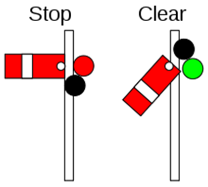

# 동기화 기법

## Mutual Exclusion (상호 배제)

상호 배제(Mutual Exclusion)는 멀티스레딩 환경에서 중요한 동시성 제어 개념이다. 이는 **한 시점에 단 하나의 스레드만이 특정한 자원이나 중요한 코드 섹션(임계 구역)에 접근**할 수 있도록 보장하는 것을 말한다.

상호 배제의 목적은 여러 스레드가 동시에 데이터를 변경하려 할 때 발생하는 레이스 컨디션과 같은 문제를 방지하는 데 있다.

스레드가 임계영역에서 Mutex 객체의 **플래그를 소유하고 있으면(락 획득) 다른 스레드가 액세스할 수 없으며**해당 임계영역에 액세스하려고 시도하는 모든 스레드는 차단되고 **Mutex 객체 플래그가 해제된 경우(락 해제)에만 액세스**할 수 있다.

이 메커니즘은 Mutex 락을 가진 오직 한개의 스레드만이 임계영역에 진입할 수 있으며 **락을 획득한 스레드만이 락을 해제 할 수 있다.**

### 즉, 뮤텍스는 락과 락해제를 통해 자원을 보호하는 락체계 동기화 도구이다.
### **상호 배제 구현 방법**

1. **Synchronized 키워드**
    - 자바에서 **`synchronized`** 키워드를 사용하여 메서드나 코드 블록을 동기화합니다.
    - **`synchronized`** 블록이나 메서드에 들어가는 스레드는 락(lock)을 획득하고, 블록을 빠져나올 때 락을 해제합니다.
2. **Lock 인터페이스**
    - **`java.util.concurrent.locks`** 패키지의 **`Lock`** 인터페이스를 사용하여 더 세밀한 제어가 가능합니다.
    - **`ReentrantLock`** 클래스는 재진입 가능한 락을 제공합니다.
3. **Semaphore**
    - 세마포어(Semaphore)는 상호 배제를 위한 또 다른 방법입니다.
    - 세마포어는 제한된 수의 허가(permit)를 가지며, 스레드는 허가를 획득해야만 임계 구역에 진입할 수 있습니다.

```java
import java.util.concurrent.locks.Lock;
import java.util.concurrent.locks.ReentrantLock;

public class SharedResource {
    private final Lock lock = new ReentrantLock();

    public void criticalSection() {
        lock.lock(); // 상호 배제 시작

        try {
            // 임계 구역: 공유 자원에 대한 연산 수행
        } finally {
            lock.unlock(); // 상호 배제 종료
        }
    }
}
```

### **상호 배제의 특징**

1. **임계 구역 보호**: 상호 배제는 임계 구역(공유 자원을 사용하는 코드 영역)을 보호 한다. 한 스레드가 임계 구역에 진입하면, 다른 스레드는 그 임계 구역에 진입할 수 없다.
2. **스레드 동기화**: 상호 배제는 스레드 간의 동기화를 제공한다. 이를 통해 데이터의 일관성과 무결성을 유지할 수 있다.

### 문제점

### **1. 데드락 (Deadlock)**

- **정의**: 두 개 이상의 스레드가 서로 다른 스레드가 보유한 뮤텍스의 해제를 기다리는 상태에 빠지면서, 모든 스레드가 영원히 대기 상태에 빠지는 현상입니다.
- **발생 조건**: 상호 배제, 점유 대기, 비선점, 순환 대기의 네 가지 조건이 모두 충족될 때 발생합니다.
- **예방**: 데드락을 예방하기 위해 자원 할당 순서를 고정하거나, 자원 요청 시 다른 모든 락을 해제하는 등의 방법을 사용할 수 있습니다.

### **2. 라이브락 (Livelock)**

- **정의**: 두 개 이상의 스레드가 서로의 작업을 완료하기 위해 반복적으로 상대방에게 자원을 양보하는 상태에 빠져, 실제로는 아무런 진행도 이루어지지 않는 상황입니다.
- **해결**: 라이브락을 해결하기 위해서는 스레드 간의 자원 양보 메커니즘을 잘 설계하여, 스레드가 무한히 자원을 양보하지 않도록 해야 합니다.

### **3. 스타베이션 (Starvation)**

- **정의**: 한 스레드가 뮤텍스를 획득하는 데 너무 오랜 시간을 기다려야 하는 상황입니다. 이는 우선순위가 낮은 스레드가 항상 우선순위가 높은 스레드에 의해 밀려나는 경우 발생할 수 있습니다.
- **해결**: 우선순위를 조정하거나, 라운드 로빈 스케줄링 같은 공평한 자원 할당 방식을 사용하여 스타베이션을 방지할 수 있습니다.

### **4. 우선순위 역전**
- **정의**: 우선순위 역전은 높은 우선순위를 가진 스레드가 낮은 우선 순위를 가진 스레드가 보유한 락을 기다리는 동안 블록되는 현상으로, 높은 우선 순위를 가진 스레드의 작업이 지연될 수 있다.
- **해결**: 우선 순위 상속으로 해결

### **5. 성능 저하**

- **문제**: 뮤텍스를 사용한 동기화는 종종 성능 저하를 초래할 수 있습니다. 특히, 임계 구역이 긴 경우나 높은 동시성을 요구하는 애플리케이션에서 이 문제가 두드러집니다.
- **해결**: 락의 범위를 최소화하거나, 락이 필요 없는 영역에서는 락을 사용하지 않는 방식으로 성능을 최적화할 수 있습니다.

### **6. 복잡성 증가**

- **문제**: 뮤텍스를 사용한 동기화는 코드의 복잡성을 증가시킵니다. 올바른 락 관리는 프로그램의 로직을 이해하기 어렵게 만들 수 있습니다.
- **해결**: 코드를 단순하게 유지하고, 락을 사용할 때는 명확한 규칙과 패턴을 따르도록 합니다.

## **Semaphore** (세마포어)

세마포어(Semaphore)는 멀티스레딩 프로그래밍에서 동시성을 제어하는 데 사용되는 중요한 동기화 메커니즘이다. 세마포어는 공유 자원에 대한 접근을 제한하는 데 사용되며, 특히 여러 자원에 대한 접근을 제어할 때 유용하다.

특정 신호에 의해 공유자원의 접근을 제어하고 보호하는 `신호체계 동기화 도구`이다.

### **세마포어의 기본 개념**

세마포어는 기본적으로 카운터로, 이 카운터는 동시에 자원에 접근할 수 있는 스레드의 수를 나타낸다.

- **카운터 값**:
    - 카운터 값이 0보다 크면, 스레드는 자원을 사용할 수 있으며, 카운터는 감소합니다.
    - 카운터 값이 0이면, 모든 자원이 사용 중이며, 추가적인 스레드는 자원이 해제될 때까지 대기해야 합니다.
- **정수형 변수 S**
- **P 연산(Acquire, Wait)**: 자원을 요청할 때 수행되며, 세마포어의 카운터를 감소시킵니다.
    - 진입 여부를 결정하는 연산(Wait 연산)
- **V 연산(Release, Signal)**: 자원을 해제할 때 수행되며, 세마포어의 카운터를 증가시킵니다.
    - 대기중인 프로세스를 깨우는 연산으로 시그널 연산


```jsx
class Semaphore {
    constructor(max) {
        this.queue = [];
        this.count = max;
    }

    async acquire() {
        if (this.count > 0) {
            this.count--;
        } else {
            // 카운트가 0이면, 큐에 프로미스 추가
            await new Promise(resolve => this.queue.push(resolve));
        }
    }

    release() {
        this.count++;
        if (this.queue.length > 0) {
            // 큐에서 대기 중인 작업을 깨움
            const resolve = this.queue.shift();
            resolve();
        }
    }
}

// 사용 예제
const semaphore = new Semaphore(2); // 동시에 2개의 작업만 허용

async function runTask(taskName) {
    await semaphore.acquire();

    console.log(`Running task: ${taskName}`);
    // 여기에 작업 수행 코드를 넣습니다.

    semaphore.release();
}

// 여러 작업 실행
runTask("Task 1");
runTask("Task 2");
runTask("Task 3");
```

이 코드에서 **`Semaphore`** 클래스는 **`acquire`** 메서드를 통해 세마포어를 획득하고, **`release`** 메서드를 통해 세마포어를 해제한다. **`acquire`** 메서드는 세마포어의 카운트가 0이 될 때까지 작업을 대기시키고, **`release`** 메서드는 카운트를 증가시키고 대기 중인 작업을 깨웁니다.

세마포어는 정수형 변수 **S** 와 **P**(Proberen: try), **V**(Verhogen: increment)의 두 가지 원자적 함수로 구성된 신호전달 메커니즘 동기화 도구이다. P 는 임계 영역을 사용하려는 스레드의 진입 여부를 결정하는 연산으로 Wait 연산이라고도 하고 V 는 대기 중인 프로세스를 깨우는 신호(Wake-up)로 Signal 연산이라고 한다.

스레드가 임계영역에 진입하지 못할 경우 자발적으로 '대기(BLOCK)'상태에 들어가고 임계영역을 빠져나오는 스레드가 대기상태의 스레드를 실행대기상태로 깨워준다. 자바에서는 java.util.concurrent 패키지에 세마포어 구현체를 포함하고 있기 때문에 직접 세마포어를 구현할 필요는 없다.



- *신호기 팔이 경사각이 수평이면 정지한다*
- *신호기 팔의 경사각이 아래로 내려오면 통과한다*
- *기차는 신호에 따라 임계영역(공유자원)인 철도를 통과할 수 있다*

### **자바에서의 세마포어 사용 예제**

자바 **`java.util.concurrent`** 패키지에는 **`Semaphore`** 클래스가 포함되어 있으며, 다음과 같이 사용할 수 있다.

```java

import java.util.concurrent.Semaphore;

public class SemaphoreExample {
    private final Semaphore semaphore = new Semaphore(5); // 5개의 자원에 대한 세마포어

    public void accessResource() {
        try {
            semaphore.acquire(); // 자원 접근을 위해 세마포어 획득
            // 자원을 사용하는 코드
        } catch (InterruptedException e) {
            e.printStackTrace();
        } finally {
            semaphore.release(); // 자원 사용 완료 후 세마포어 해제
        }
    }
}

```

이 예제에서 **`Semaphore`** 객체는 5개의 허가(permit)를 가지며, 동시에 최대 5개의 스레드가 **`accessResource`** 메서드에 접근할 수 있습니다. 스레드가 자원 사용을 완료하면 **`release`** 메서드를 호출하여 세마포어를 해제합니다.

### **정리**
| 구분 | S 연산 | P 연산 (Wait 연산) | V 연산 (Signal 연산) |
|------|---------|---------------------|----------------------|
| 의미 | 정수형 변수 | S가 1 감소 (S--) | S가 1 증가 (S++) |
| 설명 | 공유 자원의 개수를 표시하거나 개수 만큼 스레드들의 접근이 허용된다 | 스택이가 비어 구역에 진입하려고 할 때 사용되며 어떤 스레드들의 접근을 1 감소시킨다 | 스택이가 영역 구역에서 빠져나올 때 사용되며 어떤 스레드들의 접근을 1 증가시킨다 |
| 특기사항 | - S가 0보다 크면 공유자원의 접근이 허용되며 S가 0 이면 공유자원의 접근이 거부된다 | - 커널 세마포어의 P, V 함수의 S 연산은 언제 스테드 간에 상호배제 되지 않는 일관성 실형이 보장되어야 한다 |


### **세마포어의 종류**

1. **바이너리 세마포어 (Binary Semaphore)**:
    - 카운터 값이 0 또는 1만을 가집니다.
    - 뮤텍스와 유사하게 동작하여, 한 번에 하나의 스레드만이 임계 영역에 진입할 수 있습니다.
    - 한 스레드만이 세마포어를 획득할 수 있기 때문에 그 외 다른 모든 스레드가 acquired()를 호출하게 되면 해당 스레드가 세마포어를 해제하기 전까지 블록된다
    - 뮤텍스와 세마포어는 기능적으로 유사하지만, 주요 차이점이 있다. 뮤텍스는 락을 획득하고 해제할 때 같은 스레드가 작업을 수행해야 한다. 반면, 세마포어는 한 스레드가 락을 획득하고 다른 스레드가 락을 해제할 수 있어, 공유 자원에 대한 접근 제어가 좀 더 유연하다.
2. **카운팅 세마포어 (Counting Semaphore)**:
    - 카운터 값이 양의 정수를 가질 수 있습니다.
    - 여러 자원에 대한 접근을 제어하는 데 사용됩니다.
    - 카운팅 세마 포어는 카운트 변수를 설정해서 스레드가 공유할 수 있는 자원의 최대치를 한정해서 운용하는 방식으로 자원 풀(pool)이나 컬렉션의 크기에 제한을 두고자 할 때 유용하다
        - DB Connection 개수 제한, 파일 다운로드 동시 실행 제한 등..
    - 락을 획득한 스레드와 락을 해제하는 스레드는 다를 수 있으며 스레드 간 락과 락해제를 위한 신호를 전달함으로 동기화를 구현한다

### 사용하는 곳
스레드 풀이나 DB 커넥션과 같이 특정 자원에 대한 동시 접근 횟수를 제한할 때 사용한다.

### Semaphore 구조

1. **Semaphore(int permits)**
    - 지정된 수의 허가(permits)를 가진 세마포어를 생성합니다.
    - 예: `new Semaphore(5);`는 동시에 5개의 허가를 가진 세마포어를 생성합니다.
2. **Semaphore(int permits, boolean fair)**
    - 지정된 수의 허가와 공정성 설정을 가진 세마포어를 생성합니다.
    - `fair`**가 `true`일 경우, 세마포어는 대기 중인 스레드들에게 공정하게 허가를 부여합니다.
   > 공정성 비공정성  
   > 공정성(fairness)과 비공정성(unfairness)은 컴퓨팅에서 자원에 대한 접근을 제어할 때 사용되는 개념입니다. 여기서 '자원'이란 CPU 시간, 메모리 공간, 데이터베이스 연결 등이 될 수 있습니다.
   >
   > **공정성이란** 모든 요청, 프로세스 또는 스레드가 자원에 대한 접근을 공평하게 받는다는 원칙을 말합니다. 즉, 어떤 프로세스도 무기한으로 기다리게 되지 않으며, 결국은 자원에 접근할 기회를 얻게 됩니다. 예를 들어, 운영체제가 CPU 접근을 관리할 때 각 프로세스가 동일한 시간 동안 CPU를 사용할 수 있도록 스케줄링을 하는 것이 공정성에 해당합니다
   >
   > **비공정성**은 특정 프로세스 또는 스레드가 다른 것들보다 자원에 더 자주 또는 더 오래 접근할 수 있게 되어, 다른 프로세스가 공정한 기회를 받지 못하는 상황을 말합니다. 이는 '기아 상태(starvation)'로 이어질 수 있으며, 어떤 프로세스가 자원을 필요로 하더라도 영원히 대기 상태에 머물게 되는 경우를 의미합니다.

3. **void acquire()**
    - 하나의 허가를 획득합니다.
    - 사용 가능한 허가가 없으면, 현재 스레드는 사용 가능해질 때까지 대기합니다.
4. **void acquire(int permits)**
    - 지정된 수의 허가를 획득합니다.
    - 필요한 만큼의 허가가 사용 가능할 때까지 대기합니다.
5. **void release()**
    - 하나의 허가를 해제합니다.
    - 대기 중인 스레드들 중 하나가 허가를 획득할 수 있게 됩니다.
6. **void release(int permits)**
    - 지정된 수의 허가를 해제합니다.
    - 대기 중인 스레드들이 허가를 획득할 수 있게 됩니다.
7. **int availablePermits()**
    - 현재 사용 가능한 허가의 수를 반환합니다.
8. **boolean tryAcquire()**
    - 사용 가능한 허가가 있으면 즉시 허가를 획득하고 `true`를 반환합니다.
    - 사용 가능한 허가가 없으면 즉시 `false`를 반환합니다.
9. **boolean tryAcquire(long timeout, TimeUnit unit)**
    - 지정된 시간 동안 허가를 획득하려고 시도합니다.
    - 허가를 획득하면 `true`를, 시간이 초과되면 `false`를 반환합니다.
10. **boolean tryAcquire(int permits)**
    - 지정된 수의 허가를 즉시 획득하려고 시도합니다.
    - 즉시 획득할 수 있으면 **`true`**, 그렇지 않으면 `false`를 반환합니다.
11. **boolean tryAcquire(int permits, long timeout, TimeUnit unit)**
    - 지정된 시간 동안 지정된 수의 허가를 획득하려고 시도합니다.
    - 허가를 획득하면 **`true`**, 시간 초과 시 `false`를 반환합니다.
12. **void drainPermits()**
    - 현재 사용 가능한 모든 허가를 제거합니다.
    - 이 메서드는 모든 사용 가능한 허가를 제거하고 그 수를 반환합니다.
13. **void acquireUninterruptibly()**
    - 세마포어로부터 허가를 얻는 동안 인터럽트에 걸리지 않는다.

## 뮤텍스 와 세마포어

- **동작방식**
    - 뮤텍스는 공유 자원에 대한 접근을 동시에 하나의 스레드만 가능하도록 보장한다. 즉, 뮤텍스는 상호 배제를 위한 동기화 기법이다
    - 세마포어는 카운딩 기법으로, 특정 개수의 스레드가 동시에 공유 자원에 접근할 수 있도록 제어한다.
    - 0 또는 1 의 값을 가진 이진 세마포어는 뮤텍스와 유사한 역할을 하며 계수 세마포어는 양수 값을 가지며, 해당 개수 만큼 스레드가 동시에 접근 허용한다.
- **소유권**
    - 뮤텍스는 소유권이 있어서 락을 획득한 스레드만 락을 해제할 수 있다. 즉, 락을 획득한 스레드가 락을 해제하지 않도록 다른 스레드는 해당 뮤텍스에 접근할 수 없다.
    - 세마포어는 소유권이 없으며, 특정 개수의 스레드가 동시에 접근을 허용하는 카운팅 기법으로 작동한다. 따라서 세마포어를 사용하는 스레드들이 모두 세마포어를 해제할 수 있다.
- **초기값**
    - 뮤텍스는 기본적으로 잠겨있는 상태로 시작한다. 한 스레드가 뮤텍스를 획득하여 자원에 접근하면 다른 스레드들은 해당 뮤텍스를 획득하기위해 블로킹된다.
- **사용 목적**
    - 뮤텍스는 주로 상호 배제를 위해 사용되며 하나의 자원에 하나의 스레드만 접근하도록 보장해야 하는 경우에 사용한다.
    - 세마포어는 주로 리소스의 한정적인 사용을 제어하는데 사용되며 특정 개수의 스레드만이 동시에 자원에 접근하도록 제한하고자 할때 사용한다.

## Monitor(모니터)

자바가 동기화를 지원하기 위해 사용하는 메커니즘은 모니터(Monitor)이며 **뮤텍스나 세마포어보다 더 고수준의 동기화 기법**이다. **모든 자바 객체는 기본적으로 모니터를 가지며** 여러 스레드가 객체의 임계 영역(critical section)에 진입하려고 할 때 JVM 은 모니터를 사용하여 스레드 간 동기화를 제공한다.

자바의 모니터는 `상호 배제(Mutual Exclusion)`및 `협력(Cooperation)`이라는 두 가지 동기화 기능을 제공하고 있으며 이를 위해 `뮤텍스와 조건변수(Condition Variable)`를 사용한다.

즉, 모니터는 공유 자원에 대한 접근을 동기화하고, 스레드 간의 상호작용을 제어하는 데 된다. 모니터는 객체와 관련된 락(lock)과 조건 변수(condition variable)를 사용하여 구현된다.

### **모니터의 기본 구성 요소**

### 1. 상호 배제(Mutual Exclusion)

**락(Lock)**:
- 모든 자바 객체는 내장된 락을 갖고 있습니다.
- 이 락은 **`synchronized`** 메서드나 블록에 진입할 때 획득하고, 메서드나 블록을 빠져나올 때 자동으로 해제됩니다.

객체가 가지고 있는 모니터 Lock 을 통해 여러 스레드가 동시에 공유 자원에 접근하는 것을 막아 데이터의 일관성과 안전성을 보장하는 메커니즘이다. JVM 은 `'synchronized'` 키워드를 이용하여 뮤텍스 동기화를 `암묵적(내부적으로 처리)`으로 처리해 주고 있으며 synchronized 는 메서드나 코드 블록에 적용할 수 있다.

- **synchronized** (동기화)
    - synchronized 블록은 해당 객체의 모니터를 획득 할 수 있으며(상호 배제 기능을 사용할 수 있으며) 모니터를 획득한 스레드만이 임계영역에 접근 가능하고 그 외 다른 스레드들은 차단되어 대기 상태가 된다
    - synchronized 블록을 빠져 나오면 모니터 Lock 이 해제되고 대기 중인 다른 스레드 중 하나가 락을 얻고 임계 영역에 진입하여 작업을 수행하는 식으로 상호배제가 보장된다

### 2. 협력(Cooperation)

**조건 변수(Condition Variable)**:

- 자바에서는 객체의 내장된 락과 관련된 **`wait()`**, **`notify()`**, **`notifyAll()`** 메서드를 통해 조건 변수를 구현합니다.
- **`wait()`** 메서드는 `현재 스레드`를 `대기` 상태로 만들고 락을 해제합니다. 다른 스레드가 `notify()` 나 `notifyAll()`을 호출할 때까지 대기합니다.
    - 스레드가 특정 조건에 부합하지 않을 때 wait() 메서드를 호출하면 조건변수의 대기 셋(Wait Set)에 들어가 대기한다.
- **`notify()`** 메서드는 대기 중인 스레드 중 하나를 깨웁니다.
- **`notifyAll()`** 메서드는 모든 대기 중인 스레드를 깨웁니다.
    - 다른 스레드가 특정 조건을 만족해서 notify() 또는 notifyAll() 메서드를 호출하면 조건변수의 대기셋으로부터 스레드를 깨워 실행 시킨다.

협력은 모니터의 `Condition Variable (조건 변수)` 를 통해 **`스레드 간` 공동의 목표를 위해 상호협력**으로 데이터의 일관성과 안전성을 보장하는 동기화 메커니즘이다.

조건변수를 통해 **스레드 간 대기와 통지**를 서로 조절하면서 **경쟁 조건(race condition)과 같은 문제를 방지**할 수 있다. 모니터 내부에는 여러개의 조건 변수를 가질 수 있지만 **자바의 모니터에는 오직 한 개의 조건 변수만 가질 수 있다.**

### 예시

```java
public class SharedResource {
    public synchronized void accessResource() {
        // 임계 구역: 공유 자원에 접근
    }

    public synchronized void modifyResource() {
        // 임계 구역: 공유 자원을 수정
        notifyAll(); // 대기 중인 스레드들에게 알림
    }

    public synchronized void waitForCondition() throws InterruptedException {
        while (/* 조건이 만족되지 않았을 경우 */) {
            wait(); // 조건이 만족될 때까지 대기
        }
        // 조건 만족 후의 작업 수행
    }
}
```

이 예제에서 **`synchronized`** 키워드는 메서드가 모니터 락을 획득하고 해제하는 것을 의미한다. **`wait()`**, **`notify()`**, **`notifyAll()`** 메서드는 해당 객체의 조건 변수를 사용하여 스레드 간의 상호작용을 관리한다.

### 모니터 대기 세트 구조

모니터는 상호배제와 협력을 통해 임계영역에 접근을 관리할 수 있다. 이때 **상호배제**에서 synchronized 키워드를 통해 모니터락을 획득하여 스레드를 대기하게 만들거나 **협력**의 조건변수를 통해서도 스레드를 대기 시킬 수 있다. 이렇듯 2가지 방법을 통해서 스레드를 대기 시킬 수 있으므로 이 대기하는 공간 역시 2가지가 존재한다.

모니터 대기 세트는 객체의 내장 락(lock)과 밀접하게 관련되어 있으며, 자바의 모니터 내부에는 `EntrySet(진입셋)` 과 `WaitSet(대기셋)` 이라는 **대기 자료 구조**가 있으며 이들은 멀티스레드 환경에서 스레드들 간의 상호작용을 조절하는 데 사용된다.

- **Entry** **Set**
    - Entry Set 은 **모니터의 Lock 을 획득하기 위해 대기 중인 스레드들을 모아 놓은 자료 구조**로서 스레드가 Lock 을 사용 중인 경우 그외 다른 스레드는 Entry Set 에 들어가게 된다
        - 즉 임계영역에 접근하기 위해서(락 획득) 대기하는 곳
    - Entry Set 에 있는 스레드들은 Lock 이 반납될 때까지 기다리며 락이 반납되면 Entry Set 중 하나의 스레드가 락을 획득하고 임계 영역으로 진입하게 된다.
- **Wait** **Set**
    - Wait Set 은 **모니터의 조건 변수(Condition variable)와 함께 사용하는 자료구조**이며 **스레드들이 특정한 조건이 만족할 때 까지 대기**하고 있는 장소이다
    - 스레드는 Wait Set 에 들어가 대기할 때 Lock 을 해제한다. 그리고 다른 스레드에 의해 깨어나게 되면 Entry Set 으로 이동해서 다시 Lock 을 획득 할 수 있다
  > 스레드는 Wait Set 에 들어가 대기할 때 Lock 을 해제?  
  > 만약 어떠한 스레드가 락을 가지고 Wait Set에 들어가게 되면 다른 스레드들은 영원히 락을 획득할 수가 없게 된다.  
  > 그렇기 때문에 Wait Set에 들어가는 스레드는 락을 반납하여 다른 스레드들이 임계영역에 접근할 수 있도록 한다.

### 조건 변수 종류

조건변수를 통해 상호 협력하고 있는 두 스레드가 `wait()` 과 `notify()` 메서드 실행 후에 하나의모니터를 두고 두 스레드 모두 소유가 가능한 상황이 발생 했을때 하나의 대기중인 스레드, 하나는 깨우는 스레드로서 어떤 스레드가 모니터를 먼저소유할 것인가에 따라 두 종류의 조건변수로 나눌 수 있다.  하나는 **Signal and Wait** , 다른 하나는 **Signal and Continue** 이다.

### **Signal and Wait**

현재 모니터를 소유하고 있는 스레드가 `wait()`을 실행하면 모니터 내부에서 자신을 일시 중단하고 Lock을 해제한 후 Wait Set에 들어간다.깨우는 스레드 notify() 또는 notifyAll() 메서드를 호출하면 Wait Set에 대기 스레드 중 하나 또는 모든 스레드를 깨우고 **깨우는 스레드는 Lock을 해제하고 대기**한다. 이때 대기에서 깨어난 스레드가 Lock 을 획득한 후 모든 작업을 마치고 Lock 을 해제하면 깨운 스레드가 Lock을 획득한 후 계속 작업을 진행한다.

대기 스레드와 깨운 스레드 사이에 다른 스레드가 모니터를 소유할 수 없도록 원시적 실행이 보장되어야 한다.

### **Signal and Continue(자바 에서 사용하는 방식)**

현재 모니터를 소유하고 있는 스레드가 `wait()`을 실행하면 모니터 내부에서 자신을 일시 중단하고 Lock을 해제한 후 Wait Set에 들어간다. 깨우는 스레드가 `notify()` or `notifyAll()` 명령을 실행하면 Wait Set 에 있는 대기 스레드 중 하나 또는 모든 스레드를 깨우고 이때 일어난 스레드들은 Entry Set 으로 이동한다. **깨우는 스레드는 Lock을 계속 유지**하면서 모든 작업을 완료하고 **Lock을 해제하면 Eentry Set에 대기하고 있는 모든 스레드가 Lock을 획득하기 위해 경쟁**한다. 자바에서는 이 조건 변수 형식을 취하고 있다.

### 작동 구조

### **1. 스레드가 동기화된 메서드나 블록에 접근**

- **동기화 시도**: 스레드가 **`synchronized`** 메서드나 블록에 접근을 시도합니다. 이 동기화된 영역은 특정 객체(모니터)에 연결되어 있으며, 모든 자바 객체는 내장된 락을 가지고 있습니다.
- **락 획득**: 스레드는 해당 객체의 락을 획득하려고 시도합니다. 락이 이미 다른 스레드에 의해 보유되고 있다면, 해당 스레드는 Entry Set에 들어가 대기합니다.

### **2. Entry Set**

- **락 대기**: Entry Set은 해당 객체의 락을 기다리는 스레드들의 집합입니다. 락이 해제되면, Entry Set에 있는 스레드들 중 하나가 락을 획득하고 동기화된 영역에 진입합니다.

### **3. 동기화된 영역에서의 작업**

- **임계 구역 실행**: 락을 획득한 스레드는 동기화된 영역(임계 구역)에서 작업을 수행합니다. 여기서 공유 자원에 대한 접근이 이루어집니다.

### **4. 조건 대기(Wait Set)**

- **조건 확인**: 스레드가 특정 조건이 만족되지 않았다고 판단하면, **`wait()`** 메서드를 호출하여 대기 상태로 전환됩니다.
- **Wait Set으로 이동**: **`wait()`** 메서드 호출 시, 스레드는 해당 객체의 락을 해제하고 Wait Set으로 이동합니다. Wait Set은 **`wait()`** 메서드를 호출하여 대기하는 스레드들의 집합입니다.

### **5. 조건의 충족 및 알림**

- **조건 변경**: 다른 스레드가 조건을 변경할 수 있으며, 이후 **`notify()`** 또는 **`notifyAll()`** 메서드를 호출하여 Wait Set의 스레드들을 깨울 수 있습니다.
- **스레드 깨우기**: **`notify()`** 메서드는 Wait Set에서 대기 중인 스레드 중 하나를 임의로 깨우고, **`notifyAll()`** 메서드는 모든 대기 중인 스레드를 깨웁니다.

### **6. 락 재획득 및 작업 재개**

- **락 경쟁**: **`notify()`**/`notifyAll()`에 의해 깨어난 스레드들은 다시 객체의 락을 획득하기 위해 경쟁합니다(Entry Set으로 이동). 락을 획득한 스레드는 **`wait()`** 호출 이후의 코드부터 실행을 계속합니다.

### **7. 동기화된 영역 탈출 및 락 해제**

- **작업 완료**: 스레드가 동기화된 영역의 작업을 완료하면, 락을 자동으로 해제하고 동기화된 영역을 빠져나옵니다.
- **다음 스레드의 진입**: 락이 해제되면, 다른 스레드가 락을 획득하여 동기화된 영역에 진입할 수 있습니다.

```java
public class Example {
    public synchronized void synchronizedMethod() {
        while (/* 조건이 만족되지 않음 */) {
            wait(); // 현재 스레드는 Wait Set으로 이동
        }
        // 조건이 만족되면 작업 수행
    }

    public synchronized void changeCondition() {
        // 조건 변경
        notifyAll(); // Wait Set에 있는 모든 스레드를 깨움
    }
}
```

# SpinLock & Busy Waiting

## SpinLock

스핀락(SpinLock)은 뮤텍스나 세마포어와 같은 동기화 기법의 일종으로 스레드가 잠금을 얻기 위해 **반복적으로 잠금 상태를 확인하면서 기다리는 방식이**다. SpinLock을 사용하는 스레드는 잠금을 획득할 수 있을 때까지 계속해서 잠금 상태를 확인합니다.

이는 CPU 사이클을 사용하는 비효율적인 방법일 수 있지만, 잠금을 기다리는 시간이 매우 짧을 경우에는 컨텍스트 스위칭을 피하기 위한 효율적인 방법이 될 수 있다.

### 작동 방식

SpinLock은 스레드가 잠금을 획득할 수 있을 때까지 반복적으로 잠금 상태를 확인하고 기다리는 동기화 메커니즘이다.

1. **잠금 검사**: 스레드는 잠금 상태를 반복적으로 검사합니다.
2. **잠금 획득 시도**: 잠금이 해제된 것을 확인하면, 잠금을 획득하려고 시도합니다.
3. **임계 영역 진입**: 잠금을 획득하면 임계 영역(공유 자원에 대한 작업)에 진입합니다.
4. **잠금 해제**: 작업을 마치면 잠금을 해제합니다.

```java
import java.util.concurrent.atomic.AtomicBoolean;

class SpinLock {
    private final AtomicBoolean lock = new AtomicBoolean(false);

    public void lock() {
        while (true) {
            if (!lock.getAndSet(true)) {
                return;
            }
            // 잠금을 획득할 때까지 계속 반복
        }
    }

    public void unlock() {
        lock.set(false);
    }
}
```

### **Busy Waiting**

Busy Waiting은 **프로세스 또는 스레드가 특정 조건이 충족될 때까지 계속해서 조건을 평가**하는 것을 말합니다. SpinLock은 Busy Waiting의 한 형태이다.

조건이 만족될 때까지 프로세스 또는 스레드는 계속해서 조건을 확인합니다. 이 과정에서 CPU는 유용한 작업을 수행하지 않고,무한 반복 루프를 돌면서 조건을 체크하는 데에만 리소스를 사용합니다.

### 동작방식

Busy Waiting은 스레드가 특정 조건이 만족될 때까지 기다리는 동작이다.

1. **조건 검사**: 스레드는 특정 조건을 반복적으로 검사합니다.
2. **조건 충족 대기**: 조건이 만족될 때까지 계속해서 검사합니다.
3. **작업 수행**: 조건이 충족되면 필요한 작업을 수행합니다.

```java
class BusyWaitingExample {
    private volatile boolean conditionMet = false;

    public void waitForCondition() {
        while (!conditionMet) {
            // 조건이 만족될 때까지 계속 기다림
        }
        // 조건이 만족되면 필요한 작업 수행
    }

    public void setConditionMet() {
        conditionMet = true;
    }
}
```

### 스핀락의 장단점

### **장점**

1. **컨텍스트 스위칭 감소**: 스핀락은 스레드가 잠금을 획득할 때까지 대기 상태로 들어가지 않고, 대신 CPU 사이클을 사용하며 계속해서 잠금 상태를 확인합니다. 이로 인해 잠금을 얻기 위한 컨텍스트 스위칭(context switching)이 발생하지 않아 오버헤드가 줄어듭니다.
2. **짧은 대기 시간에 유리**: 잠금 대기 시간이 매우 짧은 경우, 스핀락은 컨텍스트 스위칭으로 인한 오버헤드보다 더 효율적일 수 있습니다.
3. **반응 시간 개선**: 스핀락은 잠금을 획득하자마자 즉시 실행을 계속할 수 있어, 다른 동기화 메커니즘에 비해 더 빠른 반응 시간을 제공합니다.

블로킹 대기 없이 바로 공휴 자원에 접근하려고 시도하기 때문에, 컨텍스트 스위칭 하는 시간 보다 임계영역의 대기 시간이 더 짧을 떄 유리하다.

### **단점**

1. **CPU 자원 낭비**: 스핀락은 잠금을 획득할 때까지 계속 CPU 시간을 사용하여 잠금 상태를 확인합니다. 이는 잠금이 빨리 풀리지 않는 경우에 CPU 자원을 낭비할 수 있습니다.
2. **기아 상태(starvation) 발생 가능**: 하나의 스레드가 잠금을 오래 동안 보유하고 있으면, 다른 스레드들은 잠금을 획득하기 위해 무한정 대기하는 기아 상태에 빠질 수 있습니다.
3. **멀티프로세서 시스템에서만 효과적**: 스핀락은 멀티프로세서 또는 멀티코어 시스템에서만 효과적입니다. 단일 프로세서 시스템에서는 한 스레드가 CPU를 점유하고 있으면 다른 스레드는 실행될 수 없기 때문에 효율적이지 않습니다.
4. **우선순위 역전 문제**: 높은 우선순위의 스레드가 낮은 우선순위의 스레드가 보유한 잠금을 기다리는 경우, 우선순위 역전 문제가 발생할 수 있습니다.

공유자원에 대한 경쟁이 많은 경우, 또는 대기 시간이 긴 경우에는 비효율적이며 스레드들이 공유 자원에 대한 경쟁이 강하게 발생할 경우 스핀락을 사용하면 대기 시간이 더 길어질 수 있다.

### 싱글코어 & 멀티코어

싱글코어에서 스핀락을 사용하면, 해당 스레드가 무한 루프를 돌면서 다른 스레드가 CPU를 점유할 기회를 주지 않기 때문에 싱글코어 환경에서는 일반적으로 busy waiting으로 인해 성능이 저하될 수 있으므로 멀티코어 환경에서 사용하는 것이 더 효율적이다.

스핀락은 멀티 코어 환경에 상관없이 대기 시간이 긴 경우나 공유 자원에 대한 경쟁이 많은 경우에는 다른 동기화 기법을 고려하는 것이 좋다 대부분의 경우, 스핀락보다는 뮤텍스(Mutex)나 세마포어(Semaphore) 등의 블로킹 기반의 동기화 기법을 사용하는 것이 더 적합할 수 있다.

## 자바 synchronized
자바에서 **`synchronized`** 키워드는 멀티스레딩 환경에서 동기화를 달성하기 위해 사용된다. 이 키워드는 한 시점에 하나의 스레드만이 특정 섹션의 코드에 접근하도록 보장하여, 데이터의 일관성과 스레드 안전성을 유지하는 데 도움이 된다.

자바는 단일 연산(임계 영역) 특성을 보장하기 위해 `synchronized` 키워드를 제공하고 있으며 synchronized 구문을 통해 모니터 영역을 동기화 할수 있다. synchronized 는 명시적으로 락을 구현하는 것이 아닌 **자바에 내장된 락**으로서 이를 **암묵적인 락(Intrinsic Lock)** 혹은 **모니터락 (Monitor Lock)** 이라고 한다.

`synchronized` 은 동일한 모니터를 가진 객체에 대해 **오직 하나의 스레드만 임계영역에 접근할 수 있도록 보장**하며 모니터의 조건 변수를 통해 스레드간 협력으로 동기화를 보장해 준다. 우리가 앞서 확인했던 모니터의 두가지 기능을 `synchronized`라는 키워드 안에 포함 시켜버린 것이다.

synchronized 가 적용된 한 개의 메서드만 호출해도 **같은 모니터의 모든 synchronized 메서드까지 락에 잠기게 되어 락이 해제될 때 까지는 접근이 안되는 특징**을 가지고 있다. 락은스레드가 synchronized 블록에 들어가기 전에 자동 확보되며 **정상적이든 비정상적이든 예외가 발생해서든 해당 블록을 벗어날 때 자동으로 해제**된다.

> **명시적 락 과 암묵적 락
명시적 락**
> 명시적 락은 개발자가 명시적으로 락을 관리하는 방식입니다. 자바의 **`java.util.concurrent.locks`** 패키지에서 제공하는 `ReentrantLock`과 같은 클래스를 사용하여 구현합니다. 이러한 락을 사용할 때는 락을 획득하고 반드시 해제하는 책임이 개발자에게 있습니다.

> **암묵적 락 (Intrinsic Lock 또는 Monitor Lock)**
> 암묵적 락은 자바 객체에 내장된 락으로, **`synchronized`** 키워드를 사용하여 동기화를 구현합니다. **`synchronized`** 메서드나 블록을 사용할 때, 자바는 자동으로 관련 객체에 대한 락을 획득하고 해제합니다.
>

> **같은 모니터 라는 표현**
>
>
> **모니터란?**
>
> 모니터는 동시성 프로그래밍에서 사용되는 개념으로, 공유 리소스에 대한 안전한 접근을 제공하기 위한 메커니즘입니다. 자바에서 객체의 모니터는 다음 두 가지 주요 기능을 가집니다:
>
> 1. **상호 배제(Mutual Exclusion)**: 한 시점에 하나의 스레드만이 **`synchronized`** 블록이나 메서드에 접근할 수 있습니다.
> 2. **협력(Cooperation)**: **`wait()`**, **`notify()`**, **`notifyAll()`** 메서드를 통해 스레드 간 협력을 할 수 있습니다.
>
> ### **같은 모니터의 의미**
>
> "같은 모니터"라는 표현은 특정 객체의 모니터 락을 참조합니다. 예를 들어, 하나의 객체에 대해 여러 개의 **`synchronized`** 메서드가 있다면, 이 메서드들은 모두 "같은 모니터"를 사용합니다. 즉, 한 스레드가 해당 객체의 한 **`synchronized`** 메서드를 실행하고 있으면, 다른 스레드는 동일한 객체의 다른 **`synchronized`** 메서드에 접근할 수 없습니다.
>

### 동작 방식
모든 객체는 모니터를 가진다.  
예를 들어 `Myclass my = new Myclass();`
1. Myclass 클레스
2. Myclass 를 통해서 생성한 객체

위의 2가지는 서로 다른 모니터 객체를 가진다. 즉 클레스 자체에 대해서 또는 특정 클레스를 통해서 생성된 객체 이 2가지를 이용해서 모니터 역할을 할 수 있다.

- **객체 락(Object Lock)**: `synchronized`는 객체에 대한 락을 사용한다. 메서드 또는 블록이 `synchronized`로 표시되면, 해당 코드 섹션에 접근하기 위해서는 먼저 해당 객체의 락을 획득해야 한다.
- **메서드 동기화(Method Synchronization)**: 전체 메서드를 **`synchronized`**로 선언할 수 있습니다. 이 경우, 해당 메서드는 해당 객체의 락을 사용한다.
  동시성 문제를 한번에 편리하게 제어할 수 있는 장점이 있지만 메서드 내 코드의 세부적인 동기화 구조를 가지기 어렵고 메서드 영역 전체를 동기화 하기때문에 이 영역이 클 수록 성능 저하를 가져온다.

    ```java
    
    public synchronized void synchronizedMethod() {
        // 동기화된 메서드의 코드
    }

    ```

위의 메서드는 객체의 메서드이다. 자바에서 해당 객체를 가리키는 키워드는 `this`이다. 즉 이 메서드는 `this` 라는 모니터 객체를 가지고 있다.(`this` (생성된 객체)가 모니터의 역할을 한다.)

```java

      
    public static synchronized void staticSynchronizedMethod() {
        // 동기화된 메서드의 코드
    }
```  
static 의 키워드는 객체의 영역이 아닌 클레스에 속한 영역이다. 따리서 해당 메서드의 모니터 역할은 해당 클레스 그자체이다.


- **블록 동기화(Block Synchronization)**: 특정 코드 블록을 **`synchronized`** 블록으로 만들 수 있습니다. 이 경우, 블록에 지정된 객체의 락을 사용한다.
  메서드 동기화 방식에 비해 좀더 세부적으로 임계영역을 정해서 필요한 블록만 동기화 구조를 가질 수 있다. 영역이 메서드 동기화 방식보다 작고 효율적인 구성이 가능하기 때문에 성능 저하가 덜하다.

    ```java
    
    public void method() {
        synchronized (this) { // 객체 락
            // 동기화된 블록의 코드
        }
    }
    ```

```java
       public static void staticMethod() {
        synchronized (Myclass.class) { // 클레스 락
            // 동기화된 블록의 코드
        }
    }
```

이렇게 총 4개의 메서드가 있을때 첫번째와 세번째 메서드의 모니터가 동일하고 두번재와 네번째 메서드의 모니터가 같다.  
따라서 스레드1과 스레드2가 있을때 스레드1이 `synchronizedMethod` 첫번째 메서드에 스레드2번이 `staticSynchronizedMethod` 두번째 메서드에 접근했을때 과연 동시에 두 메서드에 접근이 가능할까??

우리는 앞에서 배웠던 뮤텍스는 동시에 접근이 불가능하다. 이미 락을 획득한 스레드가 있으면 다른 스레드들은 대기해야 한다. 이때 그 기준은 동일한 뮤텍스 일때이다. 동일하게 모니터안에 뮤텍스가 있기때문에 두 메서드는 서로 다른 모니터를 가지고 있기때문에 동시에 서로다른 스레드가 접근이 가능하다.

따라서 1번과 3번, 2번과 4번은 동시에 접근이 불가능하다.(동일한 모니터)
### **사용 시 고려 사항**

1. **데이터 일관성**: `synchronized`는 여러 스레드가 동시에 공유 데이터에 접근하는 것을 방지하여 데이터의 일관성을 유지
2. **성능 저하**: 동기화는 성능에 영향을 줄 수 있다. **`synchronized`** 블록이나 메서드에 스레드가 동시에 접근할 수 없기 때문에, 스레드들은 락을 기다리는 동안 대기해야 할 수 있다.
3. **데드락(Deadlock)**: 잘못된 **`synchronized`** 사용은 데드락을 일으킬 수 있다. 예를 들어, 두 스레드가 서로 다른 두 객체의 락을 기다리고 있을 경우, 무한 대기 상태에 빠질 수 있다.
4. **객체 레벨 락**: **`synchronized`** 메서드는 **객체 레벨의 락을 사용**합니다. 따라서, **다른 스레드가 동일한 객체**의 다른 **`synchronized`** 메서드에 접근할 수 없습니다.

### 정리
* 메서드 동기화 방식 - synchronized method
    * 메소드 전체가 임계 영역(critical section)이 된다. 즉, 메소드 내의 모든 코드가 동기화 된다
    *  동시성 문제를 한번에 편리하게 제어할 수 있는 장점은 있으나 메서드 내 코드의 세부적인 동기화 구조를 가지기 어렵다
    *  메서드 전체를 동기화하기 때문에 동기화 영역이 클 경우 성능저하를 가져온다
    *  인스턴스 메서드 동기화 와 정적 메서드 동기화 방식이 있다
* 블록 동기화 방식 - synchronized block
    * 특정 블록을 정해서 임계 영역(critical section)을 구성한다. 즉 블록 내의 코드만 동기화 된다
    *  메서드 동기화 방식에 비해 좀 더 세부적으로 임계영역을 정해서 필요한 블록만 동기화 구조를 가질 수 있다
    *  메서드 전체를 동기화 하는 것보다 동기화 영역이 작고 효율적인 구성이 가능하기 때문에 성능 저하가 덜하다
    *  인스턴스 블록 동기화 와 정적 블록 동기화 방식이 있다

#### 스레드 간 객체의 메서드를 동기화하기 위해서는 스레드는 같은 객체의 모니터를 참조하고 있어야한다.

# 메소드 동기화

## synchronized method , static synchronized method
### **Synchronized Method**

**인스턴스 단위로 모니터가 동작**하며 동일한 인스턴스 안에서 **synchronized 가 적용된 곳은 하나의 락을 공유**한다. 인스턴스가 여러개일 경우 인스턴스별로 모니터 객체를 가지므로 스레드는 모니터 별로 락을 획득해서 동기화 영역에 진입하고 빠져 나올 때 락을 해제 할 수 있다.

- **락 객체**: 인스턴스 메서드에 **`synchronized`** 키워드를 사용하면, 메서드는 해당 객체의 인스턴스 락을 사용합니다.
- **동작 방식**: 스레드가 이 **`synchronized`** 인스턴스 메서드를 호출할 때마다 **해당 객체의 락**을 획득해야 합니다. 동시에 하나의 스레드만이 같은 객체의 다른 **`synchronized`** 인스턴스 메서드에 접근할 수 있습니다.
- **사용 예시**:

    ```java
    public class MyClass {
        public synchronized void syncMethod() {
            // 임계 영역
        }
    }
    
    ```

  이 경우, `MyClass`의 인스턴스마다 각각의 락이 존재합니다.


## **Static Synchronized Method**

클래스 단위로 모니터가 동작하며 synchronized 가 적용된 곳은 하나의 락을 공유한다. `인스턴스와는 별개의 모니터를 가지고` **임계 영역을 동기화** 하기 때문에 인스턴스 단위로 메서드를 호출할지라도 락은 클래스 단위로 스레드간 공유된다. **클래스는 메모리에 오직 하나만 존재**하므로 하나의 모니터를 공유해서 동기화 하고자 할 때 사용 할 수 있다.

- **락 객체**: 클래스 메서드에 **`synchronized`** 키워드를 사용하면, 메서드는 해당 클래스의 Class 객체의 락을 사용합니다.
- **동작 방식**: 클래스의 모든 **`static synchronized`** 메서드는 동일한 Class 객체의 락을 공유합니다. 따라서, 한 스레드가 어떤 클래스의 **`static synchronized`** 메서드를 실행하고 있으면, 다른 스레드는 같은 클래스의 다른 **`static synchronized`** 메서드에 접근할 수 없습니다.
- **사용 예시**:

    ```java
    
    public class MyClass {
        public static synchronized void staticSyncMethod() {
            // 임계 영역
        }
    }
    
    ```

### **주요 차이점**

- **락의 범위**: **`Synchronized`** 메서드는 객체 인스턴스 레벨의 락을 사용하는 반면, **`Static synchronized`** 메서드는 클래스 레벨의 락을 사용합니다.
- **영향 범위**: 인스턴스 메서드의 동기화는 동일 객체 인스턴스 내에서만 영향을 미치지만, **`Static synchronized`** 메서드의 동기화는 해당 클래스의 모든 인스턴스에 영향을 미칩니다.

### **동시 사용 시의 동작:** **인스턴스** **메소드 동기화 (synchronized method)  + 정적** **메소드 동기화 (static synchronized method)**

**`Synchronized`** 인스턴스 메소드와 **`static synchronized`** 메소드가 동시에 존재할 때, 이들은 **서로 다른 락**을 사용합니다. 이는 중요한 점으로, 인스턴스 메소드와 정적 메소드 사이의 동기화는 서로 독립적이다. **따라서 모니터가 섞여 있기 때문에 동기화가 의도한대로 정확하게 동작하는지 주의가 필요**하다.

1. **인스턴스 메소드 동기화**: **`synchronized`** 인스턴스 메소드는 해당 객체의 인트린직 락(intrinsic lock)을 사용합니다. 이 락은 객체 인스턴스마다 고유합니다.
2. **정적 메소드 동기화**: **`static synchronized`** 메소드는 클래스의 Class 객체의 락을 사용합니다. 이 락은 클래스 전체에 대한 락으로, 모든 인스턴스에 공통적입니다.
3. **독립적인 락**: 인스턴스 메소드와 정적 메소드의 락은 서로 다르기 때문에, 한 스레드가 인스턴스 메소드에 있는 락을 획득한 상태에서도 다른 스레드는 해당 클래스의 정적 메소드에 있는 락을 획득할 수 있습니다.

### **예시**

```java

public class Example {
    // 인스턴스 메소드 동기화
    public synchronized void instanceMethod() {
        // 임계 영역 코드
    }

    // 정적 메소드 동기화
    public static synchronized void staticMethod() {
        // 임계 영역 코드
    }

    // 사용 예시
    public static void main(String[] args) {
        Example ex = new Example();
        ex.instanceMethod(); // 이 메소드는 객체 ex의 락을 사용합니다.
    
        Example.staticMethod(); // 이 메소드는 Example 클래스의 Class 객체의 락을 사용합니다
    }
}

```

- 한 스레드가 `instanceMethod()`를 실행하고 있는 동안, 다른 스레드는 여전히 `staticMethod()`를 실행할 수 있습니다. 이는 두 메소드가 서로 다른 락을 사용하기 때문이다.
- 이러한 독립성은 동시성을 증가시킬 수 있지만, 동기화할 자원이 인스턴스와 클래스 레벨에서 서로 영향을 미칠 수 있다면 주의가 필요하다. 예를 들어, 인스턴스 메소드와 정적 메소드가 동일한 외부 자원에 접근한다면, 별도의 동기화 메커니즘이 필요할 수 있다.

# 블록 동기화

## synchronized block , static synchronized block

### synchronized block

**인스턴스 단위로 모니터가 동작**하며 synchronized 가 적용된 곳은 하나의 락을 공유한다. 모든 인스턴스가 모니터를 가지기 때문에 모니터를 여러 인스턴스로 구분해서 동기화를 구성할 수 있다. 클래스의 인스턴스가 여러개일 경우 인스턴스별로 모니터 객체를 가지며 스레드는 모니터 별로 락을 획득해서 synchronized 영역을 진입하고 빠져 나올 때 락을 해제 할 수 있다.

- **특정 객체의 락 사용**: **`synchronized`** 블록은 괄호 안에 지정된 객체의 락을 사용합니다.
- **유연성**: 메소드 전체를 동기화하는 것이 아니라 필요한 부분만 동기화할 수 있어 유연합니다.
- **예시**:

    ```java
    
    public class Example {
        private Object lock = new Object();
    
        public void method() {
            synchronized (lock) {
                // 동기화된 블록
            }
        }
          public void method2() {
            synchronized (this) {
                // 동기화된 블록
            }
        }
    }
    
    ```


### static synchronized block

클래스 단위로 모니터가 동작하며 synchronized 가 적용된 곳은 하나의 락을 공유한다. 모든 클래스가 모니터를 가지기 때문에 모니터를 여러 클래스로 구분해서 동기화를 구성할 수 있다. 클래스 모니터가 여러개일 경우 스레드는 모니터 별로 락을 획득해서 synchronized 영역을 진입하고 빠져 나올 때 락을 해제 할 수 있다.

- **클래스의 Class 객체의 락 사용**: **`synchronized`** 블록은 **`ClassName.class`**를 이용하여 클래스 레벨의 락을 사용합니다.
- **클래스 레벨 동기화**: 클래스의 모든 인스턴스에 걸쳐 동기화를 제공합니다.
- **예시**:

    ```java
    public class Example {
        public static void staticMethod() {
            synchronized (Example.class) {
                // 동기화된 정적 블록
            }
        }
  
          public static void staticMethod2() {
            synchronized (YourClass.class) {
                // 동기화된 정적 블록
            }
        }
    }
    
    ```


### **주요 차이점**

- **락의 범위**: **`Synchronized block`**은 지정된 객체의 락을 사용하는 반면, **`Static synchronized block`**은 클래스의 Class 객체의 락을 사용한다.
- **적용 범위**: 인스턴스 블록은 해당 객체의 인스턴스에만 영향을 미치는 반면, 정적 블록은 클래스 레벨에서 동기화를 수행한다.

### 인스턴스 블록 동기화 (synchronized block) + 정적 블록 동기화 (static synchronized block)
```java
public class Myclass {
    private Object lock = new Object();
    
    public synchronized void synMethod1() { //this
        // 동기화 영역
    }

    public static synchronized void synMethod2() {//Myclass
        // 동기화 영역
    }

    public void synMethod3() { //lock
        synchronized (lock) {
            // 동기화 영역    
        }
        
    }

    public void synMethod4() {// Myclass
        synchronized (this) {
            // 동기화 영역    
        }

    }


    public void synMethod5() {
        synchronized (Myclass.class) {// Myclass
            // 동기화 영역    
        }

    }

    public void synMethod() {
        synchronized (DifferentClass.class) {// DifferentClass
            // 동기화 영역    
        }

    }
}  

```
총 4개의 모니터가 존재
- Object lock
- this
- Myclass
- DifferentClass


- **독립적인 락 메커니즘**: 인스턴스 블록 동기화와 정적 블록 동기화는 서로 다른 락을 사용합니다. 인스턴스 메소드는 특정 객체의 락을, 정적 메소드는 클래스의 Class 객체 락을 사용한다.
- **병렬 실행 가능성**: 한 스레드가 인스턴스 동기화 블록에 있어도, 다른 스레드는 정적 동기화 블록을 동시에 실행할 수 있다. 이는 두 동기화 블록이 서로 다른 락을 사용하기 때문이다.
- **자원 공유 주의**: 두 동기화 블록이 동일한 자원을 다루는 경우, 개별 락에도 불구하고 여전히 동기화 문제가 발생할 수 있다. 이런 경우에는 추가적인 동기화 전략이 필요할 수 있다.

## synchronized 특성

### 재 진입성
- 모니터 내에서 이미 synchronized 영역에 들어간 스레드가 다시 같은 모니터 영역으로 들어갈 수 있는데, 이를 모니터의 재진입이라고 한다.
- 이미 락을 보유한 스레드가 다른 **`synchronized`** 블록에 진입할 때, 이 스레드는 락을 재획득할 수 있습니다. 이는 재진입 가능 락(Reentrant Lock)의 개념으로, 데드락을 방지하는 데 도움이 됩니다.
- 재 진입이 가능하다는 것은 락의 획득이 호출단위가 아닌 스레드 단위로 일어난다는 것을 의미하며 이미 락을 획득한 스레드는 같은 락을 얻기 위해 대기할 필요 없이 synchronized 블록을 만났을때 같은 락을 확보하고 진입한다.

```java
class Parent {
    public synchronized void method() {
        System.out.println("Parent Method");
    }

}

class Children extends Parent {
    @Override
    public synchronized void method() {
        System.out.println("Children Method : Before Call Parent");
        super.method();
        System.out.println("Children Method : After Call Parent");
    }
}


```
간단하게 특정 클레스에 `synchronized` 메서드 1번이 있고 이안에서 다른 `synchronized` 메서드2번을 호출했을때 이는 특정 스레드 1번이 메서드1번에 락을 획득하고 이를 해제하지 않고 바로 메소드2번의 락을 획득하고 있는 상황이다.

이는 스레드가 하나의 `synchronized` 영역 진입한 다음에 다른 `synchronized` 영역에 진입할때 그 해당 스레드가 같은 모니터를 가지고 있다면 2번째 `synchronized` 영역에 다시 재 진입하는 메소드는 다시 락을 획득하기위에 경쟁하는 것이 아니라 바로 진입하게 된다.

- 클레스를 상속하게 되면 부**모의 락과 동일한 락을 자식이 가지게 된다.**
- **동기화 된 메서드**에서 **다른 동기화 된 메서드를 호출**하는 경우 이미 락을 가지고 있는 스레드가 **같은 락을 확보하고 재진입**시 데드락이 발생하지 않고 정상적으로 진행할 수 있다.


### 가시성

- synchronized는 가시성을 지원한다.
- 가시성이란 한 스레드가 공유자원을 수정하거나 쓰기 작업을 했을때 다른 스레드가 수정한 내용이 보이는 것을 말한다.

### 그 외 특성

1. **상호 배제(Mutual Exclusion)**:
    - **`Synchronized`** 키워드가 적용된 메서드나 블록은 한 시점에 하나의 스레드만 실행할 수 있습니다.
    - 다른 스레드는 현재 실행 중인 스레드가 **`synchronized`** 블록을 완료하고 락을 해제할 때까지 대기해야 합니다.
2. **락(Lock) 메커니즘**:
    - 객체 레벨 락: 일반 **`synchronized`** 메서드는 객체의 락을 사용합니다. 이는 객체의 모든 **`synchronized`** 메서드가 같은 락을 공유한다는 것을 의미합니다.
    - 클래스 레벨 락: **`static synchronized`** 메서드는 클래스의 Class 객체의 락을 사용합니다. 이는 해당 클래스의 모든 **`static synchronized`** 메서드가 동일한 락을 공유한다는 것을 의미합니다.
3. **자동 락 관리**:
    - 스레드가 **`synchronized`** 블록에 진입할 때 자동으로 락을 획득하고, 블록을 벗어날 때 락을 자동으로 해제합니다.
4. **메모리 가시성(Memory Visibility)**:
    - **`Synchronized`**는 메모리 가시성도 제공합니다. 한 스레드가 수정한 변수의 값이 다른 스레드에게 올바르게 보이도록 보장합니다.
5. **스레드 간 협력**:
    - **`synchronized`** 블록 내에서 **`wait()`**, **`notify()`**, **`notifyAll()`** 메서드를 사용하여 스레드 간 협력이 가능합니다. 이 메서드들은 스레드가 조건이 충족될 때까지 대기하거나 다른 스레드에게 신호를 보낼 수 있게 합니다.

## 스레드간 협력

자바에서 스레드 간의 협력은 주로 **`wait()`**, **`notify()`**, **`notifyAll()`** 메서드를 사용하여 이루어집니다. 이러한 메서드들은 동기화된(synchronized) 블록 또는 메서드 내에서 호출되어야 하며, 객체의 내장 락(intrinsic lock)을 사용하여 스레드 간의 상호 작용을 조절한다.

**`wait()`**, **`notify()`**, **`notifyAll()`** 은 모니터 객체의 조건 변수오 ㅏ함께 사용해서 동기화를 구현할 수 있는 동기화 메커니즘이라 할 수 있다. 뮤텍스(상호배제) 동기화 기법은으로 충족되지 않는 동기화 문제를 해결할 수 있는 협력에 의한 동기화 장치이다.

**`wait()`**, **`notify()`**, **`notifyAll()`** 이 메소드들은 **반드시 `Synchronized`블록 안에서만 사용해야 하며** 이는 스레드가 모니터 락을 확보한 상태에서 이 API들이 작동한다는 것을 의미한다.

> 복습
>
> - **Entry Set**: 객체에 대한 동기화된 메서드나 블록에 접근하려는 스레드들이 대기하는 곳입니다. 이 곳에서 스레드들은 객체의 락을 획득하기 위해 대기한다.
> - **Wait Set**: **`wait()`** 메서드 호출로 인해 특정 객체에 대해 대기하고 있는 스레드들이 위치하는 곳입니다. 이 스레드들은 **`notify()`** 또는 **`notifyAll()`** 메서드에 의해 깨어날 때까지 대기한다.

## wait()

**`wait()`** 메서드는 **호출된 객체에 대한 락을 해제**하고, 스**레드를 객체의 Wait Set에 넣습니다**. 스레드는 **`notify()`** 또는 **`notifyAll()`** 메서드가 호출될 때까지 대기합니다.

### 동작 흐름

- 스레드를 **대기 상태로 전환**시키고 모니터 **락은 해제**되며 다른 스레드가 모니터 락을 획득하여 작업을 수행할 수 있다
- **조건 변수와 함께 사용**되어 특정 **조건이 만족될 때까지 대기**하게 되며 이를 통해 스레드 간의 효율적인 협력을 구현할 수 있다
- 다른 스레드가 동일한 모니터 락을 획득하고 notify() 또는 notifyAll() 메서드를 호출하면 대기 중의 한 스레드 혹 모든 스레드가 깨어난다
- **스레드는 깨어난 상태에서 바로 실행하는 것이 아니라 락을 획득해야 하며** 락을 획득한 스레드는 **wait() 다음 구문을 수행**하게 된다
- wait(long timeout) 을 사용하여 일정 시간 동안 대기하도록 타임아웃을 지정할 수 있으며 타임아웃이 경과하면 스레드는 자동으로 깨어난다
- 인터럽트가 걸리면 InterruptedException 예외가 발생하고 인터럽트 된 스레드는 대기에서 깨어나게 된다. 예외 처리가 필요하다.

```java
synchronized (object) {
    while (조건이 충족되지 않음) {
        object.wait();
    }
    // 조건이 충족된 후의 작업 수행
}
```

## notify(), notifyAll()

**`notify()`** 메서드는 **대기 중인 스레드 중 하나 또는 모두를 임의로 깨웁**니다. 깨어난 스레드는 대기하던 조건이 충족되었는지 다시 확인해야 합니다.

### 동작 흐름

- notify()는 같은 모니터의 **조건 변수에서 대기 중인 스레드 중에서 임의의 하나를 깨우며 notifyAll()은 스레드 전체를 깨운다.**
- **어떤 스레드가 깨어날 것인지 알 수 없으며** 무작위로 선택되기 때문에 **notify() 보다 notifyAll() 을 사용하는 것을 선호**한다
- 깨어난 스레드가 **다시 실행되어야 할 때는 해당 객체의 모니터 락을 다시 획득하기 위해 경쟁**해야 한다
- 스레드를 깨울 때 **우선순위가 높은 스레드가 깨어날 것이라는 보장은 없다.** 운영체제와 JVM의 스케줄링 정책에 따라 결정된다
- 메서드 호출 후 **synchronized 블록이 끝나기 전까지 락이 해제되지 않으며** 해당 블록에서 빠져나가야 락이 해제된다

```java
synchronized (object) {
    // 조건 변경
    object.notify();
}
```

## 스레드 간 협력의 기본 동작 구조

스레드 간 협력의 기본 동작 구조는 자바에서 **`wait()`**, **`notify()`**, **`notifyAll()`** 메서드를 사용하여 구현된다. 이들은 객체의 내장 락(intrinsic lock)을 기반으로 동작하며, 스레드가 특정 조건이 충족될 때까지 기다리거나, 조건 충족 시 다른 스레드에게 알림을 보내는 데 사용된다

> 만약 특정한 조건이 만족될 때까지 다음으로 진행하지 못한다면?
>
> - 이미 락을 소유한 스레드가 특정한 조건이 만족 될 때까지 동기화 영역을 빠져 나오지 못하므로 다른 스레드들은 락을 무한정 기다려야 하는 상황이 발생할 수 있다
> - 특정한 조건이 만족 될 때까지 계속 반복하면서 상태를 확인(SpinLock) 해야 하므로 CPU 부하 등 쓸데없는 자원낭비로 이어질 수 있다

`wait()`은 **대기(락 해제) 하게** 하고 `notify()`는 **통지(락 획득) 함**으로서 스레드간 상호 배제와 상호 협력으로 동기화를 구현할 수 있다.

### 동기화 영역에서 특정한 조건이 만족될 때가지 다음으로 진행하지 못할 경우 조건변수는 좋은 해결책
- 이미 락을 소유한 스레드가 특정한 조건이 만족 될때 까지 가지고 있는 락을 해제하고 대기하도록 한다.
- 다른 스레드가 락을 획득한 후에 특정한 상황을 해결 하고 대기 중인 스레드들을 깨우면 깨어난 스레드는 라글 다시 획득한 후 계속 프로세스를 진행하도록 한다.
- 스레드는 조건이 만족 될 때가지 계속 반복 수행 할 필요가 없으며 스레드 간 협력을 통해서 상호배제 동기호를 유지하면서 문제를 해결해 나갈 수 있다.


### **1. 동기화된 블록 또는 메서드**

스레드 간 협력은 **`synchronized`** **키워드를 사용한 블록 또는 메서드 내에서 이루어집니다.** 이는 스레드가 객체의 내장 락을 획득해야만 해당 블록 또는 메서드 내의 코드를 실행할 수 있음을 의미한다.

### **2. 조건의 대기와 신호 (wait, notify, notifyAll)**

- **wait()**:
    - 스레드가 특정 조건이 충족되기를 기다리는 동안 호출됩니다.
    - `wait()`를 호출하는 스레드는 객체의 락을 해제하고, 객체의 대기 집합(wait set)에 들어갑니다.
    - 이 스레드는 다른 스레드가 **`notify()`** 또는 `notifyAll()`을 호출할 때까지 대기합니다.
- **notify()**:
    - 다른 스레드에게 조건이 충족되었음을 알리기 위해 호출됩니다.
    - 대기 집합에 있는 스레드 중 하나를 임의로 깨워 실행을 재개하게 합니다.
- **notifyAll()**:
    - `notify()`와 유사하지만, 대기 집합에 있는 모든 스레드를 깨웁니다.
    - 여러 스레드가 동일한 조건에 대해 기다리고 있을 때 사용됩니다.

### **3. 락의 재획득과 조건 재확인**

- **락 재획득**:
    - **`notify()`** 또는 `notifyAll()`에 의해 깨어난 스레드는 객체의 락을 재획득하기 위해 경쟁합니다.
    - 락을 재획득하면, 스레드는 대기 전의 상태로 돌아가 코드 실행을 계속합니다.
- **조건 재확인**:
    - 깨어난 스레드는 대기 조건을 다시 확인해야 합니다. 이는 `notify()`가 호출된 후 조건이 여전히 충족되는지, 또는 다른 스레드에 의해 변경되었는지 확인하기 위함입니다.

### **예시 코드**

```java
javaCopy code
class SharedResource {
    private boolean condition = false; // 1.상태 변수에 따라 wiat()을 실행할 것인지 아닌지 조건을 명시한다.

    public synchronized void waitForCondition() throws InterruptedException {
        //2. wiat()을 호출하기 전에 조건을 확인하고 wait()에서 리턴된 후에도 조건을 확인해야한다.
        //3. 조건을 확인하는 구문은 반드시 while 구문이 되도록한다.
        // 알 수 없는 이유로 스레드가 깨어나는 현상이 있는데 이를 spurious wakeups 하고 notify()로 깨어나야 할 스레드가 이미 깨어나 활동하고 있는 심각한 상황이 발생할 수 있다.
        // 대기에서 깨어난 스레드가 락을 획득한 후 wait() 구문에서 리턴하여 진행을 하는데 그 전에 조건을 확인해 보니 다시 wait() 를 실행해야 하는 상태가 발생할 수 있다. 
        // 즉 깨어나서 실행하려고 하는 사이에 다른 스레드에 의해 상태 값이 변경될 가능성이 있다.
        
        while (!condition) {
            wait();  // 조건이 충족될 때까지 기다림 wiat() 메소드는 반드시 synchronized 블록안에서 실행되어야한다. 그렇지 않으면 IllegalMonitorStateException이 발생한다.
            
        }
        // 조건 충족 시 수행할 작업
        condition = false;  // 조건 초기화
    }

    public synchronized void setCondition() {
        condition = true;  // 조건 설정
        notifyAll();  // 모든 대기 중인 스레드에 신호
    }
}

```

여기서 `waitForCondition()`은 특정 조건(예: **`condition`** 변수의 값)이 충족될 때까지 대기하고, `setCondition()`은 조건을 충족시키고 대기 중인 스레드들에게 신호를 보내는 역할을 합니다.

### **요약**

스레드 간 협력은 **`wait()`**, **`notify()`**, **`notifyAll()`** 메서드를 사용하여 동기화된 블록 또는 메서드 내에서 조건의 대기와 신호를 통해 이루어 진다. 이를 통해 스레드들은 서로의 작업 상태에 따라 동작을 조율하고, 공유 자원에 대한 안전한 접근을 보장 한다.

# volatile
volaitle은 변수의 가시성과 연산의 순서를 제어하기 위해 사용하는 키워드, 스레드간 데이터의 일관성과 가시성을 보장하는 역할을 한다.

## volatile 키워드

`volatile`은 자바에서 변수를 선언할 때 사용하는 키워드로, 해당 변수의 읽기와 쓰기가 메인 메모리에서 직접 이루어지도록 보장 한다. **`volatile`** 키워드가 사용된 변수는 다음과 같은 특징을 가진다.

1. **메모리 가시성 보장**: **`volatile`** 변수는 모든 스레드에게 항상 가장 최근에 쓰여진 값이 보이도록 합니다. 이는 각 스레드가 자신의 로컬 캐시가 아닌 메인 메모리에서 변수의 값을 읽고 쓰게 함으로써 달성 된다.
2. **원자성은 보장하지 않음**: **`volatile`**은 변수의 연산이 원자적(atomic)이라는 것을 보장하지 않습니다. 예를 들어, **`volatile`** 변수에 대한 증감 연산(**`++`**)은 원자적이지 않습니다.

## **CPU 캐시 메모리 와 메인 메모리**

현대 컴퓨터는 거의 대부분 2개 이상의 CPU가 장착되어 있으며 각 코어에는 레지스터와 캐시메모리가 존재한다. CPU 캐시 메모리는 CPU 레지스터와 메인 메모리 사이에서 데이터 흐름을 최적화하고 성능을 향상시키기 위해 사용되는 고속 메모리이다.

**CPU 는 값을 읽어올 때 우선 캐시에 해당 값이 있는지 확인**하고 **없는 경우에만 메인 메모리에서 읽어오는 특성**을 가진다. 이 캐시 메모리는 메인 메모리보다 훨씬 빠르게 데이터에 접근할 수 있다.

> **캐시 메모리 (Cache Memory)**
>
>
> 캐시 메모리는 CPU와 주 메모리(RAM) 사이에 위치하며, 자주 사용되는 데이터와 명령어를 임시로 저장합니다. 이는 주 메모리에 비해 빠른 데이터 접근 속도를 제공합니다.
>
> - **속도**: 캐시 메모리는 주 메모리보다 훨씬 빠른 접근 속도를 가집니다.
> - **용도**: CPU가 반복적으로 사용하는 데이터와 명령어를 저장하여, CPU의 처리 속도를 향상시킵니다.
> - **계층 구조**: 캐시 메모리는 여러 레벨(L1, L2, L3 등)로 구성될 수 있으며, L1 캐시가 가장 빠르지만 용량이 가장 작고, L3 캐시는 상대적으로 느리지만 용량이 더 큽니다.

> **레지스터 (Register)**
>
>
> 레지스터는 CPU 내부에 있는 매우 빠른 메모리로, 현재 CPU가 실행 중인 연산에 필요한 데이터와 명령어를 저장합니다.
>
> - **속도**: 레지스터는 모든 유형의 메모리 중에서 가장 빠른 접근 속도를 제공합니다.
> - **용도**: 현재 CPU에서 실행 중인 명령어의 매개변수, 중간 결과, 기계어 명령어 등을 저장합니다.
> - **용량**: 매우 제한적인 용량을 가지며, 이는 CPU가 직접적으로 처리하는 데 필요한 소량의 정보만을 저장하기 위한 것입니다.

> **캐시 메모리와 레지스터의 차이점**
>
> 1. **위치와 속도**:
     >     - 레지스터는 CPU 내부에 위치하고, 캐시 메모리는 CPU와 주 메모리 사이에 위치합니다.
     >     - 레지스터는 캐시 메모리보다 접근 속도가 더 빠릅니다.
> 2. **용량**:
     >     - 레지스터의 용량은 매우 제한적이며, 캐시 메모리는 더 큰 용량을 가집니다.
> 3. **사용 목적**:
     >     - 레지스터는 현재 CPU에서 처리 중인 데이터를 위한 공간으로 사용됩니다.
     >     - 캐시 메모리는 자주 사용되는 데이터와 명령어를 저장하여 CPU의 성능을 향상시키는 데 사용됩니다.

### CPU가 데이터 처리를 위해 메인 메모리에 접근 할때 발생하는 과정

**1. CPU가 처리할 데이터 요청**

- CPU는 특정 작업을 수행하기 위해 데이터가 필요할 때 메인 메모리에 접근합니다. 이는 프로그램의 명령어 실행 중에 발생하는 일반적인 시나리오입니다.

**2. 캐시 메모리 확인**

- CPU가 데이터에 접근하기 전에 먼저 캐시 메모리를 확인합니다. 캐시 메모리는 작고 빠른 메모리로, CPU가 자주 사용하는 데이터와 명령어를 저장합니다.
- 캐시 메모리는 여러 레벨(L1, L2, L3 등)로 구성되어 있으며, CPU는 먼저 L1 캐시를 확인한 후 L2, L3 순으로 검색합니다.

**3. 캐시 히트와 미스**

- **캐시 히트(Cache Hit)**: 요청한 데이터가 캐시 메모리에 존재하는 경우, CPU는 즉시 해당 데이터를 사용합니다. 캐시 히트는 메모리 접근 시간을 크게 단축시킵니다.
- **캐시 미스(Cache Miss)**: 데이터가 캐시에 없는 경우, 캐시 미스가 발생하고 CPU는 메인 메모리에 직접 접근해야 합니다.

**4. 메인 메모리 접근**

- 캐시 미스가 발생하면 CPU는 메인 메모리에 접근하여 필요한 데이터를 검색합니다. 메인 메모리는 캐시보다 접근 속도가 느립니다.
- 메인 메모리에서 데이터를 읽은 후, 이 데이터는 나중에 다시 접근할 가능성을 고려하여 캐시 메모리에도 저장됩니다.

**5. 데이터 처리**

- 메모리에서 데이터를 읽은 후, CPU는 이 데이터를 처리합니다. 예를 들어, 데이터를 CPU의 레지스터로 이동시키고, 연산을 수행한 다음, 결과를 다시 메모리에 저장할 수 있습니다.

**CPU 는 처리 성능을 높이기 위해서** 속도가 느린 메인 메모리에서 데이터를 읽고 쓰는 대신 속도가 빠른  CPU **캐시 메모리에서 데이터를 읽고 저장하는 메카니즘**을 수행한다.

멀티 스레드 환경에서 CPU 에 할당된 스레드가 메인 메모리가 아닌 CPU 캐시에서 공유 변수를 참조하게 되면 서로 다른 변수 값을 스레드가 참조하게 되는 되는 상황이 발생하게 된다.

> **가시성이 보장된다는 의미**  
> 여러 스레드들이 바라보는 모든 값이 공통된 영역의 값을 참조한다는 의미  
> 메인 메모리는 하나 밖에 없기 떄문에 모든 스레드들이 이 메인 메모리를 바라보기만 한다면  가시성을 확보할 수 있다.
>
> 즉 가시성을 확보한다는 의미는 모든 데이터를 캐시 메모리가 아닌 메인 메모리에서 그 값을 읽고 쓰게 한다는 의미

### 가시성(visibility)

멀티스레드 환경에서 공유 변수의 변경 내용이 한 스레드에서 다른 스레드에게 어떻게 보이는지를 나타내는 개념을 말한다.

멀티스레드 프로그래밍에서는 여러 스레드가 동시에 변수에 액세스하고 수정할 수 있기 때문에 모든 스레드에게 변수의 값이 일관되게 보여지도록 가시성이 확보되어야 한다.

### **가시성 문제의 발생**

- **독립적인 캐시**: 멀티코어 프로세서에서 각 코어는 자체 캐시 메모리를 가지고 있습니다. 스레드가 특정 코어에서 실행되면, 해당 코어의 캐시에 데이터를 저장하고 접근합니다.
- **비동기화된 캐시 상태**: 한 스레드가 공유 변수의 값을 변경하고 이를 자신의 캐시에 저장하면, 이 변경사항이 다른 코어의 캐시에 즉시 반영되지 않을 수 있습니다. 결과적으로, 다른 스레드는 변경된 최신 값을 볼 수 없게 됩니다.

### **가시성 문제의 예**

예를 들어, 두 스레드가 각각 다른 CPU 코어에서 실행되고 있고, 두 코어는 공유 변수 `x`의 값을 캐시에 저장하고 있다.

한 스레드가 `x`의 값을 변경한다면, 이 변경사항은 해당 스레드가 실행되는 코어의 캐시에만 반영되지만 다른 코어에서 실행되는 스레드는 여전히 오래된 `x`의 값을 볼 수 있으며, 이로 인해 데이터의 일관성이 깨지고 예상치 못한 결과가 발생할 수 있습니다.

### **해결 방법**

### **Volatile 키워드**

자바에서 **`volatile`** 키워드는 **가시성 문제를 해결하는 데 사용** 된다.

`volatile`로 선언된 변수는 각 스레드에 의해 수정될 때 메인 메모리에 쓰여지고, 다른 스레드에 의해 읽힐 때 메인 메모리로부터 읽혀 진다. 이를 통해 모든 스레드가 변수의 최신 값을 볼 수 있도록 한다.

따라서 공유변수에 `volatile` 키워드를 선언하면 CPU가 데이터 작업을 할 때 메인 메모리에서 공유 변수를 직접 읽고 수정된 결과를 메모리에 즉시 반영함으로 가시성 문제를 해결한다.

### 한계점
`volatile`은 스레드 간 공유변수에 대한 **가시성**을 보장하지만 동시적 상호배제를 보장하지는 않는다. 즉, 읽기 작업하는 스레드와 쓰기작업하는 스레드가 N:1 의 상황에서는 동시성을 보장하지만 N:N의 상황에서는 동시성을 보장해주지 못한다.

### **동기화 메커니즘 (synchronized)**

**`synchronized`** 블록이나 `ReentrantLock`과 같은 동기화 메커니즘을 사용하면, 스레드가 공유 데이터에 접근하기 전에 메모리의 가시성을 보장할 수 있다. `synchronized 블록`을 사용하면 한 시점에 오직 하나의 쓰레드만이 동기화 영역에 접근할 수 있도록 보장해준다.

이는 락을 획득하거나 해제할 때 메모리 배리어(memory barrier)를 사용하여 캐시의 데이터를 주 메모리와 동기화 한다.

synchronized 블록 안에서 참조되는 모든 변수들은 메인 메모리로부터 읽어들여지고 블록을 벗어나면 그 동안 수정된 모든 변수들이 즉시 메인 메모리로 반영될 수 있도록 해준다.  **synchronized 는 상호배제와 함께 가시성의 문제까지 해결할 수 있는 기능을 포함**하고 있다`(synchronized 블록 내에서는 volatile 키워드가 없어도 된다)`

### **경쟁 조건 (Race Condition)**

경쟁 조건(Race Condition)은 멀티스레딩 환경에서 여러 스레드가 동시에 공유 자원에 접근하고, 이 자원의 결과가 그 접근 순서에 따라 달라질 때 발생하는 상황을 말합니다.

간단하게 말해서 여러 스레드가 동일한 자원에 접근 할때 그 결과값이 서로 달라질 수 있음을 의미한다.

### **경쟁 조건의 발생**

- **공유 자원에 대한 동시 접근**: 두 개 이상의 스레드가 동시에 공유 자원(변수, 파일, 데이터베이스 레코드 등)을 읽거나 수정할 때 발생 한다.
- **비동기적 실행**: 멀티스레딩 환경에서 스레드들은 서로 독립적으로 실행되며, 이들의 실행 순서는 운영 체제의 스케줄링에 따라 달라 진다.

### **경쟁 조건의 예시**

```java

public class Counter {
    private int count = 0;

    public void increment() {
        count++;  // count = count + 1
    }

    public int getCount() {
        return count;
    }
}

Counter counter = new Counter();

// 스레드 A
new Thread(() -> {
    counter.increment();
}).start();

// 스레드 B
new Thread(() -> {
    counter.increment();
}).start();

```

이 예시에서 **`counter.increment()`** 메소드는 **`count`** 변수를 증가 시킨다. 두 스레드가 거의 동시에 `increment()`를 호출하면, 한 스레드가 변수를 읽고 증가시킨 후 다른 스레드가 동일한 작업을 수행하기 전에 변수를 다시 읽을 수 있다. 이로 인해 **`count`** 변수의 최종 값은 예상치 못한 결과를 나타낼 수 있다.

### **경쟁 조건 해결 방법**

- **동기화(Synchronization)**: **`synchronized`** 키워드, `ReentrantLock`과 같은 동기화 메커니즘을 사용하여 한 시점에 하나의 스레드만이 공유 자원에 접근하도록 제한 한다.
- **원자적 연산(Atomic Operations)**: **`java.util.concurrent.atomic`** 패키지의 클래스들은 원자적 연산을 제공하여 공유 자원에 대한 안전한 접근을 보장 한다.
- **락(Lock)과 조건 변수(Condition Variables)**: 더 복잡한 동기화 요구 사항에 대해 락과 조건 변수를 사용하여 세밀한 제어를 수행할 수 있다.


## **Happens-Before 보장**

Happens-Before 보장은 특정 메모리 작업(읽기, 쓰기)의 순서를 정의하는 규칙입니다. 이 규칙은 멀티스레드 프로그램에서 하나의 스레드에서 수행된 작업이 다른 스레드에 어떻게 보이는지를 정의 한다.

즉, 한 스레드의 작업 결과가 다른 스레드에게 언제 그리고 어떻게 가시적(Visible)이 되는지를 규정하는 것이다

### **Happens-Before 규칙의 핵심**

Happens-Before 규칙의 핵심은 메모리 **가시성(Memory Visibility)과 작업 순서(Ordering)** 입니다. 이 규칙에 따르면, 특정 작업 A가 다른 작업 B보다 먼저 일어난다면("happens-before"), 작업 A의 결과는 작업 B에서 관찰될 수 있어야 한다.

### 예시

JVM 은 프로그램의 성능을 향상시키기 위해 명령어를 재 정렬하지만 volatile 변수를 사용하면 해당 변수를 읽거나 쓰는 작업은 특별한 규칙에 따라 재정렬되지 않도록 보장한다.

즉 volatile 변수 전과 후에 실행되는 명령들은 JVM 컴파일러에 의해 재 정렬 될 수 있으나 volatile 변수에 대한 명령 이전/이후에 존재한다는 규칙은 반드시 지켜진다.

> **JVM 컴파일에 의한 재정렬 이란?**
> 자바 가상 머신(JVM)에서 수행되는 코드 최적화 과정 중 하나를 가리킵니다. 이 과정에서 JVM의 Just-In-Time(JIT) 컴파일러는 프로그램의 성능을 향상시키기 위해 코드의 실행 순서를 변경(재정렬)할 수 있습니다. 이러한 최적화는 프로그램의 동작에 영향을 미치지 않는 범위 내에서 수행됩니다.
>
- **쓰기-읽기 순서 보장**: **`volatile`** 변수에 값을 쓰는 작업은 이후에 발생하는 해당 변수에 대한 모든 읽기 작업에 대해 순서가 보장됩니다. 즉, 한 스레드에서 **`volatile`** 변수를 수정한 후, 다른 스레드가 이 변수를 읽으면 항상 가장 최근에 쓰여진 값을 읽게 됩니다.

```java
public class Exam {
    private int x = 0;
    private volatile boolean flag = false;
    
    public void write() {
        x = 42;
        flag = true;
    }
    
    public void read() {
        if (flag) {
            System.out.println(x);
        }
    }
}

```
#### 컴파일 후 재정령 안됨 flag가 volatile 변수로 선언되어서 명령어 재 정렬이 일어나지 않음


```java
public class Exam {
    private int x = 0;
    private boolean flag = false;
    
    public void write() {
        x = 42;
        flag = true;
    }
    
    public void read() {
        if (flag) {
            System.out.println(x);
        }
    }
}

```
### 컴파일 전

```java
public class Exam {
    private int x = 0;
    private boolean flag = false;
    
    public void write() {
        flag = true;
        x = 42;
    }
    
    public void read() {
        if (flag) {
            System.out.println(x);
        }
    }
}

```
### 컴파일 후 재 정렬됨
모든 변수가 일반변수 이기때문에 재 정렬이 일어날 수 있음

`volatile` 키워드가 붙은 변수기준으로 그 위에 선언된 변수와 그아래 선언된 변수들은 재정령이 가능하다. 하지만 `volatile` 키워드를 기준으로 위에 선언된 변수와 아래 선언된 변수가 서로 번가라 가변수 재정령 되지는 않는다.

```java
private String b = 2;
private String c = 3;
private volatile String a = 1;

private String d = 4;
private String e = 4;

```
a를 기준으로 b,c는 재정렬 될수있고 그 밑에있는 d,e도 재정령 될수 있지만 b가 d에 있는 위치로 가거나 e가 c에 위치로 정렬되는 현상은 발생하지 않는다는 말이다.

### **작동 원리**

- **메모리 배리어**: **`volatile`** 변수에 대한 쓰기 작업이 일어날 때, Java Memory Model은 쓰기 전에 발생한 모든 메모리 작업이 쓰기 작업 이전에 완료되었음을 보장하는 '메모리 배리어'를 삽입합니다. 이로 인해 쓰기 작업 이전의 모든 변경사항이 메인 메모리에 반영됩니다.
- **가시성 보장**: **`volatile`** 변수에 대한 읽기 작업은 메인 메모리에서 최신 값을 읽어오므로, 다른 스레드에서 수행한 최근의 쓰기 작업의 결과가 항상 보장됩니다.

> **메모리 배리어란?**
`메모리 배리어(Memory Barrier)`, 또는 `메모리 펜스(Memory Fence)`는 멀티스레딩 환경에서 스레드 간의 메모리 가시성과 순서를 보장하기 위해 사용되는 낮은 수준의 프로그래밍 구조입니다. 메모리 배리어는 CPU나 컴파일러가 명령어의 실행 순서를 재배열하는 것을 제한하여, 특정 지점에서 메모리 작업의 완료를 보장합니다.
>
>
> **Java에서의 메모리 배리어**
>
> 자바에서는 **`volatile`** 키워드와 **`synchronized`** 블록을 통해 메모리 배리어의 역할이 내부적으로 처리됩니다.
>
> - **volatile 변수**: **`volatile`** 변수에 대한 쓰기 작업은 쓰기 배리어처럼 작동하여, 해당 작업 이전에 발생한 모든 메모리 작업이 쓰기 전에 완료되도록 보장합니다. 마찬가지로, **`volatile`** 변수의 읽기 작업은 읽기 배리어 역할을 하여, 해당 작업 이후의 모든 메모리 작업이 읽기 후에 발생하도록 보장합니다.
> - **synchronized 블록**: **`synchronized`** 블록의 시작과 끝에는 전체 배리어가 존재하여, 블록 내의 모든 메모리 작업이 올바르게 순서가 지켜지고 완료되도록 합니다.

## 데드락

데드락(Deadlock)은 두 개 이상의 **스레드가 서로의 작업 완료를 무한히 기다리는 상태**를 말합니다. 이 상태에서는 해당 스레드들이 영원히 진행되지 못하고, 락(lock)을 획득하거나 자원을 사용하는 것이 영원히 불가능해 진다.

즉 교착상태에서는 아무런 진전도 이루어지지 않아 작업이 진행되지 않는 문제가 발생한다. 이 DeadLock 은 **동일한 환경과 코드에서 발생할 수도 있고 발생하지 않을 수도 있다.**

여러 스레드가 동일한 자원에 접근하게 될때 이 데이터가 불일치하는 동시성문제가 발생한다. 이 문제를 해결하기위해서 적절한 동기화 기법을 사용해서 동시성 문제를 해결하는 방법을 앞에서 배웠다.

이때 이 동기화기법에 있어서 한 스레드가 공유자원에 접근하게 되면 다른 스레드들은 대기하게 된다. 이때 이 대기하는 상태에서 **자원을 점유하고 있는 스레드와 대기하고 있는 스레드 사이에서 서로의 자원을 주지 못하는 경우가 발생**할 수 있다.

즉 동시성 문제를 해결하기위해 동기화기법을 사용하였는데 거기서 문제가 다시발생하게 되는 형태가 데드락이라고 할 수 있다.

### **데드락 발생의 네 가지 조건**

데드락이 발생하기 위해서는 다음 네 가지 조건이 동시에 충족되어야 한다.

1. **상호 배제(Mutual Exclusion)**: 한 번에 하나의 스레드만이 자원을 사용할 수 있습니다.
2. **점유와 대기(Hold and Wait)**: 스레드가 최소한 하나의 자원을 점유한 상태로, 다른 스레드가 사용 중인 자원을 추가로 요구하며 대기합니다.
3. **비선점(No Preemption)**: 다른 스레드가 이미 점유하고 있는 자원은 강제로 뺏을 수 없습니다.
4. **순환 대기(Circular Wait)**: 각 스레드가 순환적으로 다음 스레드가 요구하는 자원을 점유하고 있으며, 이로 인해 무한 대기 상태가 발생합니다.

### **데드락의 예시**

가장 간단한 예시는 두 스레드가 서로 다른 두 자원을 점유하고, 동시에 상대방의 자원을 요구하는 상황입니다.

```java
class ResourceA {
    synchronized void methodA(ResourceB b) {
        // ResourceA의 일부 작업 수행
        b.methodB();
    }
}

class ResourceB {
    synchronized void methodB() {
        // ResourceB의 일부 작업 수행
    }
}

// 스레드 1
new Thread(() -> {
    resourceA.methodA(resourceB);
}).start();

// 스레드 2
new Thread(() -> {
    resourceB.methodB();
}).start();

```

여기서, 스레드 1은 `ResourceA`의 락을 획득하고 `ResourceB`의 락을 기다리고, 스레드 2는 `ResourceB`의 락을 획득하고 `ResourceA`의 락을 기다리는 상황이 발생할 수 있다.

### **데드락 해결 및 예방 방법**

데드락 방지는 데드락 발생 조건인 네 가지 중에서 최소한 1가지를 방지함으로서 네 가지를 모두 만족하지 않게 하는 기법이다. 일단 데드락이 발생하면 어플리케이션 단에서 데드락을 해소하는 것은 어렵고 서버를 재 기동하거나 종료하는 것 밖에 현실적으로 다른 해결책은 없다.

1.**한번에 하나 이상의 락을 사용하지 않는다**

- 데드락은 스레드가 락을 중첩으로 제어하면서 발생하는 경우가 많기 때문에 가능한 한 스레드가 두 개 이상의 락을 제어하는 상황을 만들지 않도록 하는 것이 좋다

    ```java
    class Resource {
        private final Object lock = new Object();
    
        public void doSomething() {
            synchronized (lock) {
                // 락을 사용한 작업
            }
        }
    }
    ```


2.**락의 순서를 잘 조정한다**

- 불가피하게 여러 개의 락을 사용해야 한다면 락의 점유 순서를 일정한 순서로 정해주도록 함으로써 데드락이 발생할 수 있는 조건 중 하나인 순환 대기를 방지하도록 한다

    ```java
    class OrderedLock {
        private final Object lock1 = new Object();
        private final Object lock2 = new Object();
    
        public void method1() {
            synchronized (lock1) {
                synchronized (lock2) {
                    // 락 lock1, 그 다음 lock2를 순차적으로 사용
                }
            }
        }
    
        public void method2() {
            synchronized (lock1) {
                synchronized (lock2) {
                    // 동일한 순서로 락 사용
                }
            }
        }
    }
    ```


3.**락 타임아웃을 건다**

- 락을 요청할 때 일정 시간 이내에 락을 얻지 못하면 다른 작업을 수행하도록 타임아웃을 설정한다.
- 락 획득에 타임아웃 오류가 나면 오래 기다리지 않고 제어권이 다시 돌아오기 때문에 현재 소유한 락을 해제하고 잠시 기다리다가 데드락 상황이 지나가면 다시 정상으로 동작할 수 있다

    ```java
    import java.util.concurrent.locks.ReentrantLock;
    import java.util.concurrent.TimeUnit;
    
    class TimeoutLock {
        private final ReentrantLock lock = new ReentrantLock();
    
        public void tryLockMethod() {
            try {
                if (lock.tryLock(1000, TimeUnit.MILLISECONDS)) { // 1초 타임아웃
                    try {
                        // 임계 영역
                    } finally {
                        lock.unlock();
                    }
                } else {
                    // 타임아웃 후의 작업
                }
            } catch (InterruptedException e) {
                Thread.currentThread().interrupt();
            }
        }
    }
    ```


4.**메서드는 오픈 호출 형태로 구현한다**

- 락을 전혀 확보하지 않은 상태에서 메서드를 호출하는 것을 오픈 호출이라고 하며 락을 전체 메서드에 적용하지 않고 락이 필요한 임계영역만 보호하도록 한다
- 여러 개의 락을 호출하더라도 동시에 락을 점유하는 것이 아닌 순차적으로 락을 획득하고 해제하는 방식으로 메서드를 호출하도록 한다

    ```java
    class OpenCall {
        private final Object lock = new Object();
    
        public void openCallMethod() {
            // 락을 획득하기 전에 필요한 작업
            synchronized (lock) {
                // 임계 영역
            }
            // 락을 해제한 후의 작업
        }
    }
    ```


5.**스레드 덤프를 활용한다**

- 스레드 덤프에는 실행중인 스레드의 모든 스택 트레이스가 담겨져 있고 락과 관련된 정보도 포함되어 있기 때문에 이를 활용해서 어디에서, 어떤 스레드가 , 어느 시점에 , 왜 데드락이 발생했는지 원인을 추척 및 분석하고 해결방안을 모색할 수 있다.

## 그외 활동성 문제

### **기아 상태 (Starvation)**

기아 상태는 특정 스레드나 프로세스가 필요한 자원을 무기한으로 기다리게 되는 상황을 말합니다. 다른 스레드들이 우선적으로 자원을 점유하거나 실행되어 해당 스레드가 자원을 얻지 못하게 되면 기아상태가 발생한다.

이는 일반적으로 자원에 대한 접근이 우선순위나 다른 스레드에 의해 지속적으로 차단될 때 발생합니다.

- **원인**: 일부 스레드가 높은 우선순위를 가지거나, 자원을 과도하게 점유하고 있어 다른 스레드가 자원을 사용할 기회를 얻지 못하는 경우에 발생합니다.
- **결과**: 낮은 우선순위의 스레드 또는 자원을 요청하는 스레드가 무한히 대기하는 상태가 됩니다.
- **해결**: 우선순위를 기반으로 한 스케줄링이 아니라 공정성을 고려하여 모든 스레드가 공평하게 실행될 수 있도록 우선순위를 조정하는 등의 설계가 뒷받침 됨어야 한다.

### **라이브락 (Livelock)**

라이브락은 스레드들이 실제로는 아무런 진전도 이루지 못하면서도 계속해서 실행 상태인 것처럼 보이는 상황을 말합니다. 라이브락은 데드락과 다르게 작업이 멈추지 않고 계속해서 진행되지만, 실질적인 작업이 진행되지 않거나 진행이 제대로 이루어지지 않는 상태를 의미한다.

스레드들은 서로를 피해 자원을 사용하려고 하지만, 결국 아무것도 수행하지 못하는 상태가 됩니다. 또는 서로의 자원을 기다리기 거나 서로가 양보하는 동작이 반복되면서 진행이 지연되는 상태가 발생한다.

- **원인**: 라이브락은 보통 스레드들이 서로의 작업을 방해하지 않으려고 할 때 발생합니다. 예를 들어, 두 스레드가 서로의 작업을 방해하지 않기 위해 동시에 자원을 놓아주려고 하면, 끊임없이 이러한 상태가 반복될 수 있습니다.
- **결과**: 스레드들이 계속해서 실행되고 있지만, 실제로는 어떠한 유용한 작업도 수행하지 못합니다.
- ```java
  public class LivelockExam{
  
  static class Worker{
    private boolean isBusy;
    public Worker(){
    this.isBusy = true;
  }
  public void doWorkWith(Worker partner){
    while(isBusy){
        if(partner.isBusy){
            Thread.sleep(1);
            System.out.println("다른 스레드에게 양보!");
        }else{
            System.out.println("other person will continue working");
            this.isBusy = flase;
        }
  
    }
  }
  
    
  }
  public static void main(String[] args){
    Worker worker1 = new Worker();
    Worker worker2 = new Worker();
  
    new Thread(() -> worker1.doWorkWith(worker2)).start();
    new Thread(() -> worker2.doWorkWith(worker1)).start();
  }
  
  }
  ```
### **차이점**

- **데드락**: 스레드가 서로의 자원을 기다리면서 완전히 멈춘 상태.
- **기아 상태**: 스레드가 자원에 대한 접근을 무기한 대기하는 상태, 하지만 시스템은 여전히 작동 중.
- **라이브락**: 스레드들이 실행 상태이지만 실제로는 진전을 이루지 못하는 상태.
  