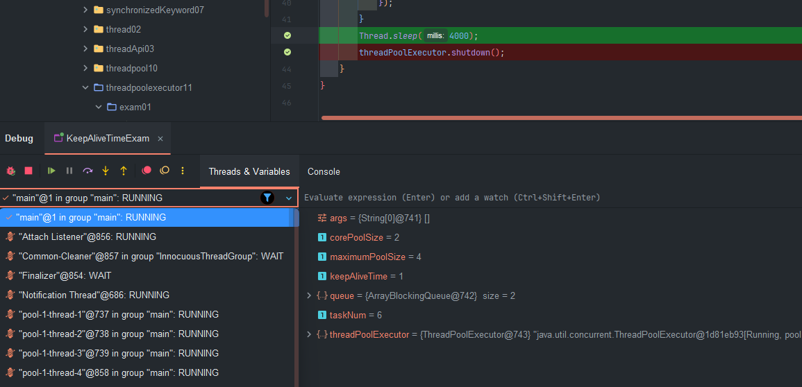
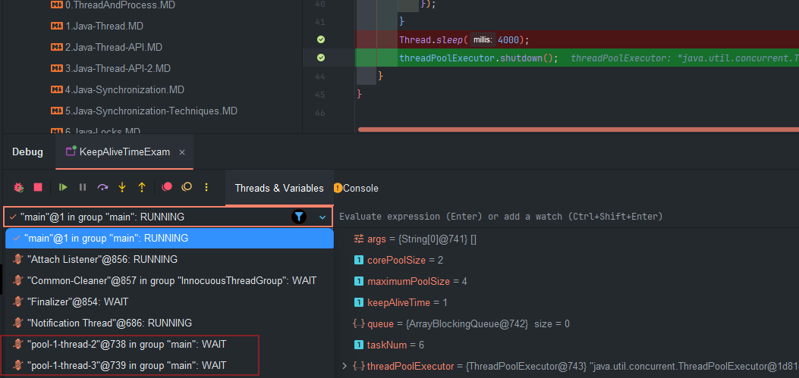

# ThreadPoolExecutor
hreadPoolExecutor는 Java의 java.util.concurrent 패키지에서 제공하는 클래스 중 하나로, 다중 스레드 환경에서 효율적으로 작업을 관리하고 실행할 수 있게 해주는 매우 중요한 도구입니다. ThreadPoolExecutor는 스레드 풀을 관리하며, 스레드 생성 및 종료의 오버헤드를 줄이고, 시스템 자원의 효율적인 사용을 돕습니다.  
  
ThreadPoolExecutor 는 ExecutorService를 구현한 클레스로 매개변수를 통해 다양한 설정과 조정이 가능하며 사용자가 직접 컨트롤 할 수 있는 스레드 풀이다.  
  
## ThreadPoolExecutor의 기본 구성 요소
    
### 생성자
```java
    public ThreadPoolExecutor(int corePoolSize,
                              int maximumPoolSize,
                              long keepAliveTime,
                              TimeUnit unit,
                              BlockingQueue<Runnable> workQueue,
                              RejectedExecutionHandler handler){
    //...... 
     }
```

### Core Pool Size & Maximum Pool Size
**`Core Pool Size`** (corePoolSize) 는 스레드 풀 내에서 항상 유지될 스레드의 최소 개수입니다. 이 값보다 적은 수의 스레드가 존재할 때 새로운 작업이 들어오면 새로운 스레드를 생성하여 작업을 처리합니다.

**`Maximum Pool Size`** (maximumPoolSize)는 스레드 풀 내에서 허용되는 최대 스레드의 개수입니다. corePoolSize를 초과하는 스레드는 작업 큐가 꽉 찼을 때만 생성됩니다.  
  
즉 `ThreadPoolExecutor` 는 `corePoolSize` 및 `maximumPoolSize` 로 설정된 개수에 따라 풀 크기를 자동 조절하고 새 작업이 제출 될때 `corePoolSize` **미만**의 스레드가 실행중이면 `corePoolSize` 가 될때 까지 **새 스레드를 생성**하고 `corePoolSize` 를 **초과**할 경우 **큐 사이즈가 남아 있으면 큐에 작업을 추가**하고 **큐가 가득차 있는 경우** `maximumPoolSize` 가 될때까지 **새 스레드를 생성**한다.  
  
**setCorePoolSize** 및 **setMaximumPoolSize** 메서드를 사용해서 동적으로 값을 변경할 수 있다. 기본적으로 스레드 풀은 스레드를 미리 생성하지 않고 새 작업이 도착할 때만 생성하지만 `prestartCoreThread` 또는 `prestartAllCoreThreads` 메서드를 사용하여 동적으로 재정의 할 수 있다.

```css

[새 작업 제출됨]
         |
         v
[현재 실행 중인 스레드 수 < corePoolSize] --> [새 스레드 생성하여 작업 처리]
         |
         v
[현재 실행 중인 스레드 수 ≥ corePoolSize] --> [작업을 Work Queue에 추가]
                                                     |
                                                     v
[Work Queue가 가득 참] --------------------------------------> [현재 실행 중인 스레드 수 < maximumPoolSize] --> [새 스레드 생성하여 작업 처리]
                                                     |
                                                     v
[현재 실행 중인 스레드 수 ≥ maximumPoolSize] --> [RejectedExecutionHandler에 의해 처리]

```
### 예제
```java
public static void main(String[] args) {
    // 기본 파라미터 설정
    int corePoolSize = 2;
    int maximumPoolSize = 4;
    long keepAliveTime = 0L; // 유지 시간
    BlockingQueue<Runnable> queue = new LinkedBlockingQueue<>(); // 큐에 제한이 없다.
    int taskNum = 9;

    ThreadPoolExecutor threadPoolExecutor = new ThreadPoolExecutor(corePoolSize, maximumPoolSize, keepAliveTime, TimeUnit.SECONDS, queue);

    for (int i = 0; i < taskNum; i++) {
        final int taskId = i;
        threadPoolExecutor.execute(() -> {
            System.out.println(Thread.currentThread().getName() + ": 가 잡을 실행하고 있습니다 [" + taskId + "]");
        });
    }

    threadPoolExecutor.shutdown();
}
```  
실행 결과:  
```
pool-1-thread-1: 가 잡을 실행하고 있습니다 [0]
pool-1-thread-1: 가 잡을 실행하고 있습니다 [2]
pool-1-thread-1: 가 잡을 실행하고 있습니다 [3]
pool-1-thread-1: 가 잡을 실행하고 있습니다 [4]
pool-1-thread-1: 가 잡을 실행하고 있습니다 [5]
pool-1-thread-1: 가 잡을 실행하고 있습니다 [6]
pool-1-thread-1: 가 잡을 실행하고 있습니다 [7]
pool-1-thread-1: 가 잡을 실행하고 있습니다 [8]
pool-1-thread-2: 가 잡을 실행하고 있습니다 [1]
```
큐에 제한이 없기 때문에 절대 maximumPoolSize 까지 스레드를 생성하지 않는다.  
  
```java
    public static void main(String[] args) {
        // 기본 파라미터 설정
        int corePoolSize = 2;
        int maximumPoolSize = 4;
        long keepAliveTime = 0L; // 유지 시간
        BlockingQueue<Runnable> queue = new ArrayBlockingQueue<>(4); // 큐에 제한이 있음 최대 4개
        int taskNum = 8;

        ThreadPoolExecutor threadPoolExecutor = new ThreadPoolExecutor(corePoolSize, maximumPoolSize, keepAliveTime, TimeUnit.SECONDS, queue);

        for (int i = 0; i < taskNum; i++) {
            final int taskId = i;
            threadPoolExecutor.execute(() -> {
                System.out.println(Thread.currentThread().getName() + ": 가 잡을 실행하고 있습니다 [" + taskId + "]");
            });
        }

        threadPoolExecutor.shutdown();
    }

```
  
실행 결과:  
```
pool-1-thread-1: 가 잡을 실행하고 있습니다 [0]
pool-1-thread-4: 가 잡을 실행하고 있습니다 [7]
pool-1-thread-1: 가 잡을 실행하고 있습니다 [2]
pool-1-thread-4: 가 잡을 실행하고 있습니다 [3]
pool-1-thread-1: 가 잡을 실행하고 있습니다 [4]
pool-1-thread-4: 가 잡을 실행하고 있습니다 [5]
pool-1-thread-3: 가 잡을 실행하고 있습니다 [6]
pool-1-thread-2: 가 잡을 실행하고 있습니다 [1]
```
스레드가 maximumPoolSize 까지 생성된 것을 확인할 수 있다. 현재는 작업이 8개인데 만약 작업이 9개 되어서 최대 생성할 수 있는 스레드의 개수와 큐의 크기보다 작업이 많은 경우가 발생한다. 이때 **`RejectedExecutionException`** 예외가 발생한다.  
  
### Keep-Alive Time
스레드가 idle 상태(작업을 수행하지 않는 상태)로 유지될 최대 시간입니다. 이 시간이 지나면 **corePoolSize 를 초과하는 스레드는 종료**됩니다. 기본값은 0이며, 단위는 TimeUnit으로 설정할 수 있습니다.  

Keep-Alive 정책은 corePoolSize 스레드 보다 많은 스레드가 있을 때만 적용 되지만 allowCoreThreadTimeOut(boolean) 메서드를 사용하여 core 스레드에도 적용할 수 있다. Executors.newCachedThreadPool() 로 풀이 생성된 경우 대기 제한 시간이 60초이며 Executors.newFixedThreadPool() 인 경우 제한 시간이 없다.  
  
### 예제
```java
    public static void main(String[] args) throws InterruptedException {
        // 기본 파라미터 설정
        int corePoolSize = 2;
        int maximumPoolSize = 4;
        long keepAliveTime = 1L; // 유지 시간
        BlockingQueue<Runnable> queue = new ArrayBlockingQueue<>(2);
        int taskNum = 6;

        ThreadPoolExecutor threadPoolExecutor =
                new ThreadPoolExecutor(corePoolSize,
                        maximumPoolSize,
                        keepAliveTime,
                        TimeUnit.SECONDS,
                        queue);

        for (int i = 0; i < taskNum; i++) {
            final int taskId = i;
            threadPoolExecutor.execute(() -> {
                try {
                    Thread.sleep(2000);
                } catch (InterruptedException e) {
                    throw new RuntimeException(e);
                }
                System.out.println(Thread.currentThread().getName() + ": 가 잡을 실행하고 있습니다 [" + taskId + "]");
            });
        }
        Thread.sleep(4000);
        threadPoolExecutor.shutdown();
    }
```
  

  
스레드 1 과 스레드 4번이 종료된 것을 확인할 수 있다.  
  
### BlockingQueue (스레드 풀 작업 대기 장소)
BlockingQueue는 Java의 java.util.concurrent 패키지에 포함된 인터페이스로, 생산자-소비자 패턴을 효율적으로 구현하기 위한 기본적인 구조를 제공합니다. BlockingQueue는 여러 스레드 간에 안전하게 데이터를 공유할 수 있도록 설계된 스레드-안전한 큐입니다.

이 인터페이스는 특히 스레드 풀과 같은 다중 스레드 환경에서 중요한 역할을 하며, 특정 작업이 큐에 추가되거나 큐에서 작업을 가져올 때 대기할 수 있는 기능을 제공합니다.   
  
BlockingQueue의 주요 특성 중 하나는, 큐가 비어 있을 때 take() 메서드로 작업을 가져오려는 스레드는 큐에 항목이 추가될 때까지 대기하고, 큐가 가득 차 있을 때 put() 메서드로 작업을 추가하려는 스레드는 큐에 공간이 생길 때까지 대기하는 것입니다.  
  
### 동작 방식
기본적으로 스레드 풀은 작업이 제출되면 corePoolSize 의 새 스레드를 추가해서 작업을 할당하고 큐에 작업을 바로 추가하지 않는다. corePoolSize 를 초과해서 스레드가 실행중이면 새 스레드를 추가해서 작업을 할당하는 대신 큐에 작업을 추가한다(큐가 가득 찰때까지)  
  
큐에 공간이 가득차게 되고 스레드가 maxPoolSize 이상 실행중이면 더 이상 작업은 추가되지 않고 거부 된다.  
  
### 구현체  

1. **`SynchronousQueue`**:
    - newCachedThreadPool() 에서 사용합니다.
    - **크기가 0인 특수한 형태의 큐로**, 항목을 저장하지 않습니다. 
    - 스레드 간에 작업을 직접 전달하는 역할을 하며 작업을 대기열에 넣으려고 할 때 실행할 스레드가 즉시 없으면 새로운 스레드를 생성합니다.
    - 생산자와 소비자가 직접적으로 동기화되는 방식으로 동작합니다.
    - 평균적인 처리보다 더 빨리 작업이 요쳥되면 스레드가 무한정 증가할 수 있다.
2. **`LinkedBlockingQueue`**:
    - Executors.newFixedThreadPool() 에서 사용합니다.
    - 링크드 리스트를 기반으로 하는 큐로, 큐의 크기를 제한하거나 제한하지 않을 수 있습니다. 크기가 지정되지 않으면, 기본적으로 큐의 크기는 `Integer.MAX_VALUE`로 설정됩니다.
    - 큐의 크기가 제한되지 않는 경우, 사용 가능한 메모리만큼 큐에 항목을 추가할 수 있습니다.
    - **FIFO** 방식으로 동작합니다.
3. **`ArrayBlockingQueue`**:
    - 크기가 고정된 큐입니다. 큐의 크기를 생성할 때 지정해야 하며, 이후에는 크기가 변경되지 않습니다.
    - 큰 대기열과 작은 풀을 사용하면 CPU 사용량 OS 리소스 및 컨텍스트 전환 오버헤드를 최소화 되지만 낮은 처리량을 유발할 수 있다.
    - 작은 대기열과 큰 풀을 사용하면 CPU 상용률이 높아지지만 대기열이 가득 찰 경우 추가적인 작업을 거부하기 때문에 처리량이 감소할 수 있다
    - **FIFO** 방식으로 동작합니다.
4. **`PriorityBlockingQueue`**:
    - 우선순위가 높은 요소가 먼저 처리되는 큐입니다. 큐에 삽입된 요소는 자연 순서(Comparable) 또는 제공된 Comparator에 따라 정렬됩니다.
    - 내부적으로 힙(heap) 자료구조를 사용하여 우선순위 순으로 요소를 관리합니다.
    - **FIFO** 순서가 보장되지 않으며, 우선순위가 높은 요소가 먼저 처리됩니다.
    - 크기가 제한되지 않는 큐입니다.
5. **`DelayQueue`**:
    - 요소가 특정 시간 후에만 큐에서 소비될 수 있는 큐입니다. 각 요소는 일정 시간 동안 대기해야 하며, 그 시간이 지나야 큐에서 꺼낼 수 있습니다.
    - 주로 지연 작업이나 일정한 시간 간격으로 작업을 처리해야 할 때 사용됩니다.
    - 큐의 크기는 제한되지 않으며, 요소는 큐에 지정된 지연 시간에 따라 정렬됩니다.

### 주요 메서드

`BlockingQueue`는 기본적으로 다음과 같은 메서드를 제공합니다:  

| 메서드 | 반환값 | 블록 여부 | 예외 처리 |
| --- | --- | --- | --- |
| `add(E e)` | `true` (성공 시) | **아니오** | `IllegalStateException` (큐가 가득 찬 경우) |
| `offer(E e)` | `true` (성공 시), `false` (실패 시) | **아니오** | 없음 |
| `put(E e)` | 없음 | **예** | `InterruptedException` (스레드가 인터럽트된 경우) |
| `remove()` | 큐의 첫 번째 요소 | **아니오** | `NoSuchElementException` (큐가 비어 있는 경우) |
| `poll()` | 큐의 첫 번째 요소 또는 `null` | **아니오** | 없음 |
| `take()` | 큐의 첫 번째 요소 | **예** | `InterruptedException` (스레드가 인터럽트된 경우) |

### 주요 메서드 설명

- **`add(E e)`**: 큐에 요소를 추가합니다. 큐가 가득 찬 경우 예외를 던집니다.
- **`offer(E e)`**: 큐에 요소를 추가하려고 시도하며, 큐가 가득 차면 `false`를 반환합니다.
- **`put(E e)`**: 큐에 공간이 생길 때까지 대기하며 요소를 추가합니다.
- **`remove()`**: 큐의 첫 번째 요소를 제거하고 반환합니다. 큐가 비어 있으면 예외를 던집니다.
- **`poll()`**: 큐의 첫 번째 요소를 제거하고 반환합니다. 큐가 비어 있으면 `null`을 반환합니다.
- **`take()`**: 큐에서 요소를 꺼내며, 큐가 비어 있으면 요소가 추가될 때까지 대기합니다.


### 예제 코드

다음은 `ArrayBlockingQueue`를 사용하는 간단한 예제입니다:

```java
import java.util.concurrent.*;

public class BlockingQueueExample {
    public static void main(String[] args) throws InterruptedException {
        // 크기가 3인 ArrayBlockingQueue 생성
        BlockingQueue<String> queue = new ArrayBlockingQueue<>(3);

        // Producer 스레드 (요소를 큐에 삽입)
        Thread producer = new Thread(() -> {
            try {
                queue.put("A");
                System.out.println("Produced A");
                queue.put("B");
                System.out.println("Produced B");
                queue.put("C");
                System.out.println("Produced C");
                // 큐가 가득 차 있기 때문에, 이 시점에서 put은 블록됩니다.
                queue.put("D");
                System.out.println("Produced D");
            } catch (InterruptedException e) {
                Thread.currentThread().interrupt();
            }
        });

        // Consumer 스레드 (큐에서 요소를 가져옴)
        Thread consumer = new Thread(() -> {
            try {
                Thread.sleep(2000); // Producer가 먼저 실행되도록 잠시 대기
                System.out.println("Consumed " + queue.take());
                System.out.println("Consumed " + queue.take());
                System.out.println("Consumed " + queue.take());
                System.out.println("Consumed " + queue.take());
            } catch (InterruptedException e) {
                Thread.currentThread().interrupt();
            }
        });

        producer.start();
        consumer.start();

        producer.join();
        consumer.join();
    }
}

```
```java

    public E take() throws InterruptedException {
        final ReentrantLock lock = this.lock;
        lock.lockInterruptibly();
        try {
            while (count == 0)
                notEmpty.await();
            return dequeue();
        } finally {
            lock.unlock();
        }
    }

```  
take 메서드는 큐에 값이 없으면  요소가 추가될때까지 대기하는 것을 코드상에서 확인할 수 있다.  

LinkedBlockingQueue:  
```java
    public E take() throws InterruptedException {
        final E x;
        final int c;
        final AtomicInteger count = this.count;
        final ReentrantLock takeLock = this.takeLock;
        takeLock.lockInterruptibly();
        try {
            while (count.get() == 0) {
                notEmpty.await();
            }
            x = dequeue();
            c = count.getAndDecrement();
            if (c > 1)
                notEmpty.signal();
        } finally {
            takeLock.unlock();
        }
        if (c == capacity)
            signalNotFull();
        return x;
    }

```
해당 큐 같은 경우는 값이 추가 되면 signal() 메서드를 호출하여 대기중인 스레드를 깨워준다.


### 실행 결과

- `Produced A`
- `Produced B`
- `Produced C`
- `Consumed A`
- `Consumed B`
- `Consumed C`
- `Produced D`
- `Consumed D`

이 예제에서 `ArrayBlockingQueue`는 크기가 3으로 제한되어 있습니다. 따라서 생산자가 네 번째 항목을 삽입하려고 할 때 큐가 가득 차 있어 대기하게 됩니다. 소비자가 큐에서 항목을 제거한 후에야 생산자는 네 번째 항목을 큐에 삽입할 수 있습니다.

### `BlockingQueue`의 활용

`BlockingQueue`는 특히 다음과 같은 상황에서 유용하게 활용됩니다:

- **스레드 풀에서 작업 관리**: `ThreadPoolExecutor`와 같은 스레드 풀은 작업을 관리하기 위해 `BlockingQueue`를 사용합니다. 작업을 큐에 넣고 스레드가 처리할 수 있을 때까지 대기합니다.
- **생산자-소비자 패턴**: 이 패턴에서는 `BlockingQueue`를 사용하여 생산자가 생성한 데이터를 소비자가 처리할 때까지 안전하게 저장하고 전달할 수 있습니다.
- **자원 제한**: 특정 자원이 제한된 상황에서, 자원이 사용 가능할 때까지 대기하거나 사용 가능한 자원을 효율적으로 할당하기 위해 `BlockingQueue`를 사용할 수 있습니다.

`BlockingQueue`는 이러한 강력한 기능을 제공하여 멀티스레드 환경에서 안전하고 효율적인 작업 처리를 가능하게 해줍니다.  
  
## RejectedExecutionHandler (스레드풀 포화 정책)
RejectedExecutionHandler는 Java의 java.util.concurrent 패키지에서 제공하는 인터페이스로, **스레드 풀에서 작업이 거부될 때 처리 방법**을 정의합니다.  
  
ThreadPoolExecutor는 작업을 제출할 때 스레드 풀의 용량(작업 큐와 최대 스레드 수)을 초과하는 경우 작업을 처리할 수 없게 되며, 이때 RejectedExecutionHandler가 호출되어 작업이 거부되는 상황에 대한 처리를 할 수 있습니다.  
  
### 동작과정
execute(Runnable) 로 제출된 작업이 풀의 포화로 인해 거부될 경우 execute() 메서드는 RejectedExecutionHandler.rejectedExecution() 메서드를 호출한다.  
  
미리 정의된 4가지 정채 클래스가 제공되며 직접 사용자 정의 클래스를 만들어서 사용할 수 있다.  
- **`ThreadPoolExecutor.AbortPolicy`**:
    - 기본 정책으로, 작업이 거부되면 `RejectedExecutionException`을 발생시킵니다.
    - 이 방식은 작업이 거부될 때 예외를 던져 호출자에게 알리므로, 작업이 손실되거나 무시되는 것을 방지할 수 있습니다.
- **`ThreadPoolExecutor.CallerRunsPolicy`**:
    - 거부된 작업을 호출한 스레드가 직접 실행하도록 합니다.
    - 이 방식은 스레드 풀이 가득 차더라도 작업을 무시하지 않고 호출자 스레드에서 작업을 실행함으로써 일종의 백업 메커니즘을 제공합니다. 그러나 이 방식은 호출자 스레드의 성능에 영향을 미칠 수 있습니다.
- **`ThreadPoolExecutor.DiscardPolicy`**:
    - 거부된 작업을 그냥 무시(삭제)합니다.
    - 이 방식은 작업이 거부되었을 때 아무런 조치를 취하지 않고 작업을 폐기합니다. 작업이 필수적이지 않을 때 사용할 수 있지만, 중요한 작업이 무시될 수 있다는 위험이 있습니다.
- **`ThreadPoolExecutor.DiscardOldestPolicy`**:
    - 큐에서 가장 오래된 작업을 삭제하고, 거부된 작업을 다시 큐에 삽입하려고 시도합니다.
    - 이 방식은 새로운 작업을 처리하기 위해 오래된 작업을 제거하는 방식으로, 중요도가 높은 최신 작업을 우선시하고 싶을 때 사용할 수 있습니다.

### 예제 코드

다음은 `ThreadPoolExecutor`와 `RejectedExecutionHandler`를 사용하는 간단한 예제입니다. 이 예제에서는 `CallerRunsPolicy`를 사용하여 작업이 거부될 경우 호출자 스레드에서 직접 실행하도록 합니다.

```java
import java.util.concurrent.*;

public class RejectedExecutionHandlerExample {
    public static void main(String[] args) {
        // 스레드 풀 생성: 코어 스레드 2, 최대 스레드 4, 큐 크기 2
        ThreadPoolExecutor executor = new ThreadPoolExecutor(2, 4, 10, TimeUnit.SECONDS, new ArrayBlockingQueue<>(2));

        // CallerRunsPolicy를 사용하여 작업이 거부되면 호출자 스레드에서 실행
        executor.setRejectedExecutionHandler(new ThreadPoolExecutor.CallerRunsPolicy());

        for (int i = 0; i < 10; i++) {
            final int taskId = i;
            executor.execute(() -> {
                System.out.println("Task " + taskId + " is running on " + Thread.currentThread().getName());
                try {
                    Thread.sleep(2000);
                } catch (InterruptedException e) {
                    Thread.currentThread().interrupt();
                }
            });
        }

        // 스레드 풀 종료
        executor.shutdown();
    }
}

```

### 동작 설명

- **스레드 풀 설정**: 이 예제에서는 코어 스레드 2개, 최대 스레드 4개, 큐 크기 2로 설정된 `ThreadPoolExecutor`를 생성합니다.
- **CallerRunsPolicy 사용**: 작업이 거부될 경우 `CallerRunsPolicy`를 사용하여 호출자 스레드에서 작업을 실행합니다.
- **작업 제출**: 10개의 작업을 스레드 풀에 제출합니다. 큐와 스레드 풀이 가득 차면, 남은 작업은 호출자 스레드에서 실행됩니다.

### 실행 결과

작업이 큐에 추가되지 못하고 거부되면, 해당 작업은 호출자 스레드에서 실행됩니다. 예를 들어:

```arduino
Task 0 is running on pool-1-thread-1
Task 1 is running on pool-1-thread-2
Task 2 is running on pool-1-thread-1
Task 3 is running on pool-1-thread-2
Task 4 is running on pool-1-thread-1
Task 5 is running on main
Task 6 is running on main
Task 7 is running on main
Task 8 is running on main
Task 9 is running on main

```

여기서, `Task 5`부터 `Task 9`까지는 큐와 스레드 풀이 가득 차서 호출자 스레드(main)에서 실행되는 것을 볼 수 있습니다.

### 요약

- **`RejectedExecutionHandler`**: 작업이 스레드 풀에서 거부될 때 어떤 조치를 취할지 정의하는 인터페이스입니다.
- **주요 구현체**:
    - `AbortPolicy`: 작업 거부 시 예외 발생.
    - `CallerRunsPolicy`: 호출자 스레드에서 작업을 실행.
    - `DiscardPolicy`: 작업을 무시.
    - `DiscardOldestPolicy`: 큐에서 오래된 작업을 제거하고, 새로운 작업을 시도.

`RejectedExecutionHandler`는 스레드 풀이 가득 찼을 때 작업이 어떻게 처리되는지 제어할 수 있는 중요한 역할을 하며, 다양한 상황에 맞는 적절한 처리 방식을 선택하는 데 도움을 줍니다.  

### ThreadPoolExecutor 내부 코드

```java
public void execute(Runnable command) {
    if (command == null)
        throw new NullPointerException();
    /*
     * 1. 먼저 corePoolSize보다 작은 경우 새로운 스레드를 생성하여 작업을 처리하려고 시도합니다.
     *    만약 스레드 생성이 성공하면 작업이 처리되고, 이 메서드는 종료됩니다.
     */
    int c = ctl.get();
    if (workerCountOf(c) < corePoolSize) {
        if (addWorker(command, true))
            return;
        c = ctl.get();
    }
    /*
     * 2. corePoolSize보다 크거나, 작업 큐에 여유 공간이 있는 경우
     *    작업을 작업 큐에 추가합니다.
     */
    if (isRunning(c) && workQueue.offer(command)) {
        int recheck = ctl.get();
        if (!isRunning(recheck) && remove(command))
            reject(command); // 큐에 추가 후 풀 상태를 재검사하고, 실행할 수 없는 경우 작업 거부
        else if (workerCountOf(recheck) == 0)
            addWorker(null, false);
    }
    /*
     * 3. 스레드 풀도 가득 차 있고, 작업 큐도 가득 찬 경우
     *    새로운 작업을 추가할 수 없기 때문에 작업을 거부합니다.
     */
    else if (!addWorker(command, false))
        reject(command);
}

```

### `reject(command)` 메서드

`reject(command)` 메서드는 `RejectedExecutionHandler`를 통해 작업을 거부하기 위해 호출됩니다. `ThreadPoolExecutor` 클래스에서 이 메서드는 다음과 같이 정의됩니다:

```java
final void reject(Runnable command) {
    handler.rejectedExecution(command, this);
}

```

### 코드 설명

1. **코어 스레드 풀 검사**: `execute` 메서드는 먼저 현재의 스레드 수가 `corePoolSize`보다 작은지 확인하고, 그렇다면 새로운 스레드를 생성하여 작업을 처리하려고 시도합니다. 이 경우, 작업이 즉시 처리되고 메서드는 종료됩니다.
2. **작업 큐에 작업 추가**: 스레드 수가 `corePoolSize` 이상이고, 작업 큐에 여유 공간이 있는 경우, 작업을 큐에 추가합니다. 큐에 추가된 후에도 풀 상태를 재검사하여 여전히 실행할 수 없는 경우(예: 스레드 풀이 종료 상태로 변경된 경우) `reject(command)` 메서드를 호출하여 작업을 거부합니다.
3. **스레드 풀 및 큐가 가득 찬 경우**: 스레드 풀도 가득 차 있고, 작업 큐도 가득 찬 경우 더 이상 작업을 처리할 수 없기 때문에 `reject(command)` 메서드를 호출하여 작업을 거부합니다.
  
  
### ThreadPoolExecutor Hook 메서드
ThreadPoolExecutor 클래스느 스레드 풀을 관리하고 작업 실행 시점에 특정한 이벤트를 처리하기 위한 Hook 메서드 제공합니다.  
### 1. `beforeExecute(Thread t, Runnable r)`

이 메서드는 `ThreadPoolExecutor`의 스레드가 작업을 실행하기 전에 호출됩니다.

**사용 예시:**

- 로깅: 작업이 실행되기 전에 로그를 남기고 싶을 때.
- 상태 점검: 작업이 실행되기 전에 스레드 풀의 상태를 점검하고 싶을 때.

**구현 예시:**

```java

@Override
protected void beforeExecute(Thread t, Runnable r) {
    super.beforeExecute(t, r);
    System.out.println("Before executing: " + r.toString() + " on thread: " + t.getName());
}

```

### 2. `afterExecute(Runnable r, Throwable t)`

이 메서드는 `ThreadPoolExecutor`의 스레드가 작업을 완료한 후 호출됩니다. 작업이 성공적으로 완료되었는지, 예외가 발생했는지를 확인할 수 있습니다.

**사용 예시:**

- 결과 기록: 작업의 성공 또는 실패 결과를 기록하고 싶을 때.
- 리소스 정리: 작업 후에 필요한 정리 작업을 수행하고 싶을 때.

**구현 예시:**

```java

@Override
protected void afterExecute(Runnable r, Throwable t) {
    super.afterExecute(r, t);
    if (t != null) {
        System.out.println("Exception occurred during task execution: " + t.getMessage());
    } else {
        System.out.println("Task completed successfully: " + r.toString());
    }
}

```

### 3. `terminated()`

이 메서드는 `ThreadPoolExecutor`가 정상적으로 종료된 후 호출됩니다. 이 메서드를 오버라이드하여 스레드 풀이 종료된 후에 필요한 후처리를 할 수 있습니다.

**사용 예시:**

- 자원 해제: 스레드 풀 종료 후 리소스를 해제하고 싶을 때.
- 로그 기록: 스레드 풀 종료 상태를 기록하고 싶을 때.

**구현 예시:**

```java

@Override
protected void terminated() {
    super.terminated();
    System.out.println("ThreadPoolExecutor has terminated.");
}

```

### 메서드 동작 원리

1. **`beforeExecute(Thread t, Runnable r)`**:
    - 이 메서드는 스레드가 작업을 실행하기 직전에 호출됩니다. 스레드가 `Runnable` 작업을 시작하기 전의 상태를 점검하거나, 추가적인 작업을 수행할 때 유용합니다.
2. **`afterExecute(Runnable r, Throwable t)`**:
    - 작업이 완료된 후 호출됩니다. 작업 중 발생한 예외를 확인하고, 예외 처리 또는 결과 기록을 수행할 수 있습니다. 이 메서드는 `Throwable` 매개변수를 통해 작업 중 발생한 예외를 전달받습니다.
3. **`terminated()`**:
    - 스레드 풀의 모든 작업이 완료되고, 스레드 풀의 상태가 `TERMINATED`로 설정된 후 호출됩니다. 이 메서드는 스레드 풀의 정상적인 종료 후에 마지막 정리 작업을 수행할 때 사용됩니다.
  
  
## 생명 주기
### 1. 기본 개념

`ThreadPoolExecutor`는 다음과 같은 주요 구성 요소를 포함합니다:

- **Core Pool Size (핵심 스레드 수)**: 기본적으로 유지되는 스레드의 수입니다.
- **Maximum Pool Size (최대 스레드 수)**: 풀에서 허용하는 최대 스레드 수입니다.
- **Keep Alive Time (유휴 시간)**: 핵심 스레드 수를 초과한 스레드가 유휴 상태일 때 유지되는 시간입니다.
- **BlockingQueue (작업 큐)**: 제출된 작업이 대기하는 큐입니다.
- **ThreadFactory (스레드 팩토리)**: 새로운 스레드를 생성하는 데 사용되는 팩토리입니다.
- **RejectedExecutionHandler (거부된 작업 처리기)**: 큐가 가득 차거나 최대 스레드 수에 도달했을 때의 작업 처리 방법입니다.

### 2. 생명 주기

`ThreadPoolExecutor`의 생명 주기는 다음과 같은 단계로 나눌 수 있습니다:

### 2.1. 초기화

- **생성**: `ThreadPoolExecutor` 객체를 생성할 때, 핵심 스레드 수, 최대 스레드 수, 유휴 시간, 작업 큐, 스레드 팩토리, 작업 거부 처리기 등의 매개변수를 설정합니다.

    ```java
    ThreadPoolExecutor executor = new ThreadPoolExecutor(
        4, // corePoolSize
        10, // maximumPoolSize
        60L, // keepAliveTime
        TimeUnit.SECONDS, // time unit for keepAliveTime
        new LinkedBlockingQueue<>(), // workQueue
        Executors.defaultThreadFactory(), // threadFactory
        new ThreadPoolExecutor.AbortPolicy() // handler
    );
    
    ```


### 2.2. 작업 제출

- **작업 제출**: `executor.execute(Runnable command)` 또는 `executor.submit(Callable<T> task)` 메서드를 호출하여 작업을 제출합니다. 제출된 작업은 작업 큐에 저장되거나, 현재 활성 스레드 중 하나에 의해 즉시 실행됩니다.

    ```java
    executor.execute(() -> {
        // 작업 코드
    });
    
    ```


### 2.3. 스레드 관리

- **스레드 생성**: 작업이 제출되면, 스레드 풀은 현재 활성 스레드 수와 큐의 상태를 기반으로 새로운 스레드를 생성할 수 있습니다. 핵심 스레드 수를 초과하는 경우, 새로운 스레드가 생성되어 작업을 처리합니다.
- **스레드 종료**: 작업이 완료되면, 스레드는 유휴 상태로 남아 있으며, 유휴 시간이 지나면 종료됩니다. 스레드는 `keepAliveTime` 이후에 종료됩니다.  
  


### 생명 주기
ThreadPoolExecutor 는 다양한 생명주기와 상태를 가지며 상태에 따라 작업 스레드 풀의 동작이 결정된다.  

- RUNNING: 기본 상태로, 스레드 풀이 작업을 받고 실행할 준비가 되어 있습니다.
- SHUTDOWN: shutdown() 메서드가 호출되면, 스레드 풀은 더 이상 새로운 작업을 받지 않지만, 대기 중인 작업은 계속 처리합니다.
- STOP: shutdownNow() 메서드가 호출되면, 스레드 풀은 모든 대기 중인 작업을 취소하고 현재 실행 중인 작업을 중단합니다.
- TIDYING : 모든 작업이 종료되었으며 workerCount 가 0인 상태에서 terminated() 훅 메서드를 실행한다.
- TERMINATED: 스레드 풀이 완전히 종료된 상태입니다. shutdown() 또는 shutdownNow() 호출 후, 모든 작업이 완료되고 스레드가 종료되면 이 상태가 됩니다.
  
이런 상태는 다음과 같이 전환 된다:  
- RUNNING -> SHUTDOWN : shutdownNow() 메서드가 호출될때 스레드 풀은 종료 상태로 전환됩니다.
- SHUTDOWN -> STOP : shutdownNow() 메서드가 호출될때 스레드 풀은 SHUTDOWN 상태 에서 STOP 상태로 전환됩니다.
- SHUTDOWN -> TIDYING : 큐와 풀이 모두 비어 있을 때 SHUTDOWN 상태에서 TIDYING 상태로 전환됩니다.
- STOP -> TIDYING : 풀이 비어 있을 때 STOP 상태에서 TIDYING 상태로 전환됩니다.
- TIDYING -> TERMINATED : terminated() 훅 메서드가 실행되고 완료되면 TIDYING 상태서 TERMINATED 상태로 전환 됩니다.  
  
### ThreadPoolExecutor 흐름도

```sql
+-----------------------------+
|    Main Thread / Client     |
+-----------------------------+
                |
                | submit(task)
                v
+-----------------------------+
|     ThreadPoolExecutor      |
|         (RUNNING)           |
+-----------------------------+
| - 새로운 작업 수용           |
| - 작업 큐에 대기             |
| - corePoolSize 스레드 유지   |
| - 필요 시 maxPoolSize까지 스레드 생성 |
+-----------------------------+
                |
                |
    +-----------+-----------+
    |                       |
    | (Check corePoolSize)  |
    |                       |
    v                       |
+---------------------+     |
|     corePoolSize    |     |
|    스레드 여유로움   |     |
+---------------------+     |
| - 스레드가 큐에서 작업 가져옴  |
| - 작업 실행          |
+---------------------+     |
                |           |
                v           |
+---------------------+     |
|      큐 비어있음     |     |
+---------------------+     |
| - 작업 대기 없음     |     |
| - maxPoolSize까지 스레드 생성   |
+---------------------+     |
                |           |
                v           |
+---------------------+     |
|  corePoolSize 초과   |     |
|   스레드 생성 가능   |     |
+---------------------+     |
                |
                v
+-------------------------------+
|   Thread Factory & Task Execution |
+-------------------------------+
| - 스레드 생성 및 관리            |
| - 스레드가 작업 실행             |
| - 인터럽트 여부 확인            |
+-------------------------------+
                |
                | (Interrupt Check)
                v
+-------------------------------+
|  Check for Interruptions      |
+-------------------------------+
| - 인터럽트 여부 확인           |
| - 인터럽트된 경우 작업 취소    |
+-------------------------------+
                |
                v
+-------------------------------+
|       Queue/Pool Check        |
+-------------------------------+
| - 큐 비어있음 또는 모든 작업 완료  |
| - workerCount가 0              |
+-------------------------------+
                |
                | (Status Transition)
                v
+-----------------------------+    +-----------------------------+
|          SHUTDOWN           |    |           STOP              |
+-----------------------------+    +-----------------------------+
| - 새로운 작업 수용 안 함    |    | - 새로운 작업 수용 안 함   |
| - 대기 중인 작업 계속 실행  |    | - 대기 중인 작업 취소      |
| - 큐와 스레드 상태에 따라 TIDYING 상태 전환 |  | - 실행 중인 작업 중단    |
| - corePoolSize 유지         |    | - 스레드가 비어있으면 상태 전환 |
+-----------------------------+    +-----------------------------+
                |                               |
                | (Queue/Pool Empty)            | (Pool Empty)
                v                               v
+-------------------------------+   +-------------------------------+
|          TIDYING              |   |          TIDYING              |
+-------------------------------+   +-------------------------------+
| - 모든 작업 종료              |   | - 모든 작업 종료              |
| - workerCount가 0            |   | - workerCount가 0            |
| - `terminated()` 훅 메서드 실행 |   | - `terminated()` 훅 메서드 실행 |
+-------------------------------+   +-------------------------------+
                |
                | (terminated() completed)
                v
+-----------------------------+
|       TERMINATED            |
+-----------------------------+
| - 추가 작업 없음            |
| - 최종 종료 상태           |
| - 모든 스레드 종료          |
+-----------------------------+

```

### 상세 설명

1. **Main Thread / Client**:
    - 작업을 제출 (`submit(task)`).
2. **ThreadPoolExecutor (RUNNING)**:
    - 작업을 수용하고 큐에 대기시킵니다.
    - `corePoolSize` 만큼의 스레드를 유지합니다.
    - 필요 시 `maxPoolSize`까지 스레드를 생성합니다.
3. **스레드 생성 및 작업 실행**:
    - **corePoolSize**:
        - 스레드가 여유로우면 큐에서 작업을 가져와 실행합니다.
    - **큐 비어있음**:
        - 큐에 작업이 없으면 추가 스레드를 생성할 수 있습니다 (`maxPoolSize`까지).
    - **corePoolSize 초과**:
        - 스레드가 부족할 경우 추가 스레드를 생성합니다.
4. **Thread Factory & Task Execution**:
    - **스레드 생성 및 관리**:
        - `ThreadFactory`가 새로운 스레드를 생성합니다.
    - **작업 실행**:
        - 스레드는 큐에서 작업을 가져와 실행합니다.
    - **인터럽트 처리**:
        - 인터럽트 여부를 확인하고, 인터럽트된 경우 작업을 취소합니다.
5. **Queue/Pool Check**:
    - 큐가 비어있거나 모든 작업이 완료되었는지 확인합니다.
    - `workerCount`가 0이 되면 상태 전환을 고려합니다.
6. **상태 전환**:
    - **SHUTDOWN**:
        - `shutdown()` 호출 시 전환됩니다.
        - 새로운 작업을 수용하지 않으며 대기 중인 작업을 계속 실행합니다.
        - 큐와 스레드 풀이 비어 있으면 **TIDYING** 상태로 전환됩니다.
    - **STOP**:
        - `shutdownNow()` 호출 시 전환됩니다.
        - 새로운 작업을 수용하지 않으며 대기 중인 작업을 취소합니다.
        - 실행 중인 작업을 중단하고, 스레드 풀이 비어 있을 때 **TIDYING** 상태로 전환됩니다.
    - **TIDYING**:
        - 모든 작업이 종료되고 `workerCount`가 0이 되면 **TERMINATED** 상태로 전환됩니다.
        - `terminated()` 훅 메서드를 실행하여 최종 정리 작업을 수행합니다.
    - **TERMINATED**:
        - `terminated()` 훅 메서드 실행 완료 시 전환됩니다.
        - 스레드 풀이 완전히 종료된 상태입니다.
